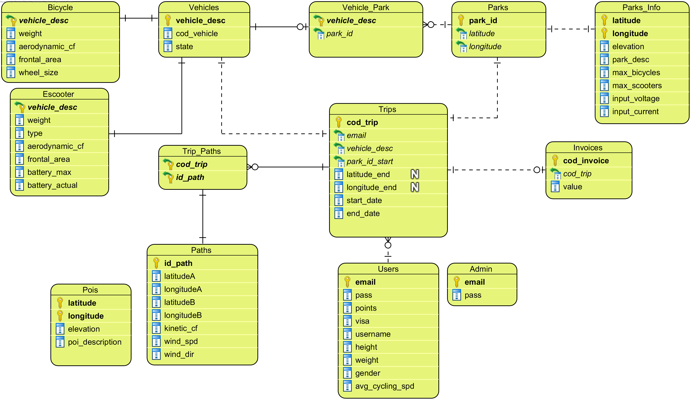
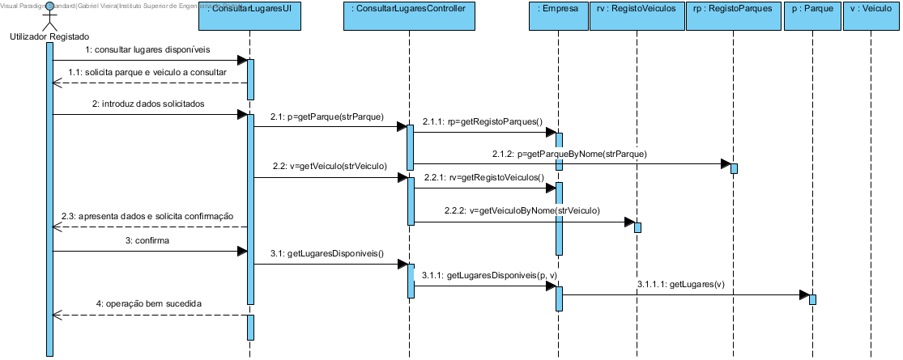
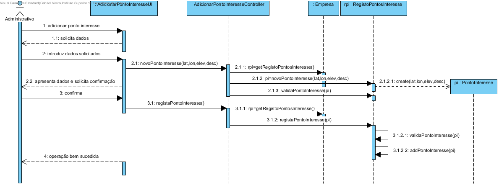
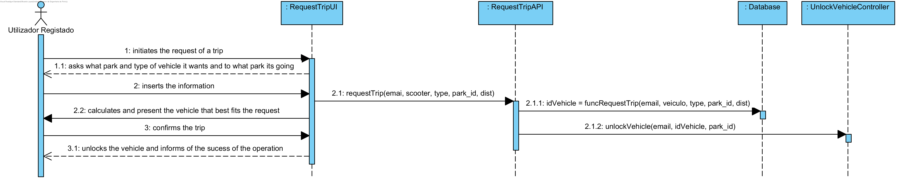
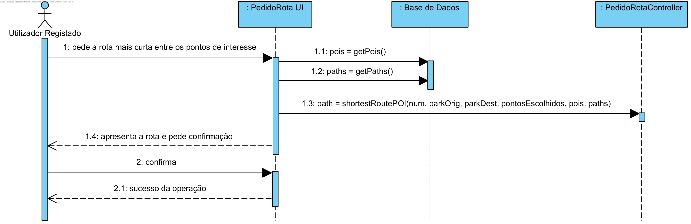
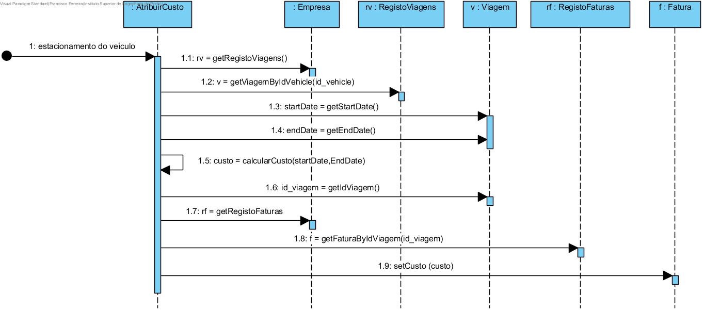
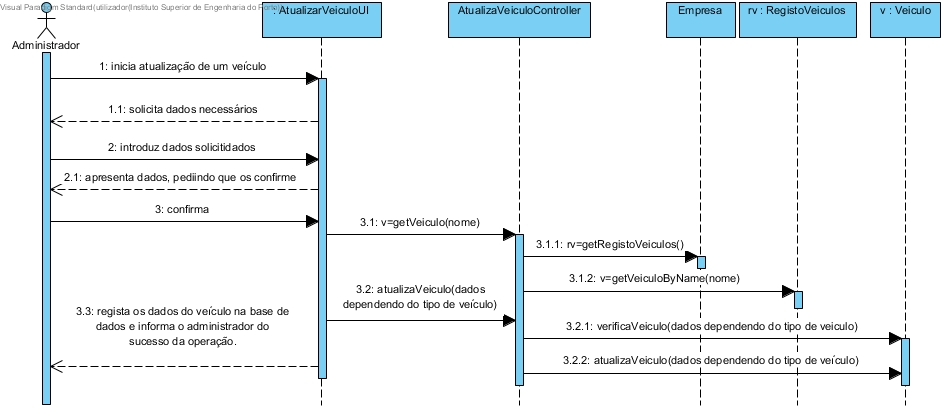

# RELATÓRIO LAPR3 2DD GRUPO 4 #

Realizado por: Ricardo Lopes: 1180669; Gabriel Vieira: 1180683; Jorge Pessoa: 1180761; Diogo Soares: 1180704; Francisco Ferreira: 1180682; Luis Blanco: 1170822
---------------------------------

# DIAGRAMA DE CASOS DE USO #

# MODELO DOMÍNIO #

# MODELO RELACIONAL #

# Funcionalidades #
Apresentam-se de seguida as funcionalidades implementadas, bem como a descrição de cada uma delas acompanhadas dos diagramas de sequência.

# Remover um parque #
Esta funcionalidade permite ao administrador remover um parque do sistema.

# Consultar lugares de estacionamento disponíveis #
Esta funcionalidade permite ao utilizador consultar os lugares de estacionamento disponíveis para um determinado parque.

# Remover um veículo #
Esta funcionalidade permite ao administrador remover um veículo do sistema que consiste em alterar o estado dele, de disponível para não disponível. Desta forma, o veículo não é removido literalmente do sistema.

# Adicionar pontos de interesse #
Esta funcionalidade permite adicionar pontos de interesse ao sistema.

# Gerar fatura mensal #
Esta funcionalidade permite gerar a fatura mensal.

# Obter report com os veículos desbloqueados num dado momento e por quem #
Esta funcionalidade permite obter um report com os veículos desbloqueados num dado momento e por quem.

# Obter os parques mais próximos da posição atual do utilizador, fornecendo a sua localização exata #
Esta funcionalidade permite obter parques mais próximos da posição atual do utilizador, fornecendo a sua localização exata.

# Alugar um veículo #
Esta funcionalidade permite alugar um veículo, sendo que apenas um veículo pode estar em uso por utilizador.

# Calcular o vento #
Esta funcionalidade permite calcular o vento de um determinado caminho.

# Fazer um Pedido #
Esta funcionalidade permite fazer um pedido passando por parametro o email, se é scooter ou não, tipo de veiculo, id do parque e a distancia a percorrer.

# Estacionar um veículo #
Esta funcionalidade permite estacionar um veículo acabando assim uma trip fornecendo o codigo, latitude e longitude.

# Receber email com o estado do veiculo #
Esta funcionalidade permite receber um email ao estacionar um veículo, fornecendo o codigo pedido e se foi bem estacionado ou náo

# Escolher rota mais curta que passe em pontos de interesse dados pelo utilizador #
Esta funcionalidade calcula o caminho mais curto entre 2 parques passando em pontos fornecidos pelo utilizador

# Escolher rota mais eficientemente energética entre dois parques #
Esta funcionalidade calcula o caminho mais eficientemente energético entre dois parques, retornando a distancia.

# Escolher rota mais eficientemente energética entre dois parques que passe em pontos de interesse dados pelo utilizador #
Esta funcionalidade calcula o caminho mais eficientemente energético entre dois parque que passe em pontos de interesse dados pelo utilizador.

# Registar na aplicação
Esta funcionalidade permite que um utilizador não registado se registe na aplicação, utilizando o seu nome, email, género, peso, carta de condução e CCV, de modo a puder usufruir de todos os benefícios de ser utilizador registado.

# Atualizar um parque
Esta funcionalidade permite que o administrador atualize a informação de um parque, para que os utilizadores consultem informações atualizadas e fidedignas desse parque.

# Atribuir pontos
Esta funcionalidade disponibiliza a atribuição de pontos do utilizador. Assim que um veículo seja estacionado, o sistema gera a atribuição de pontos, de modo a que os utilizadores possam usufruir dos seus pontos. 
[SD_UC17.png](./report/DesignOO/SD_UC17.png)    

# Obter relatório com a carga atual dos veículos e a estimativa de tempo até à carga total de cada de um dos veículos para um parque
Esta funcionalidade dá a possibilidade ao administrador de adquirir um relatório de um parque com as cargas atuais e respetivos tempos de carga total de cada veículo, de modo a adquirir infomações sobre os veículos (escooters) do parque. 

# Gerar fatura de uso de veículo
Esta funcionalidade disponibiliza o facto que assim que o pedido esteja finalizado seja gerada a fatura do pedido, de modo que os utilizadores possam visualizar a descrição dos valores debitados de acordo com o pedido.

# Mostrar veículos dísponiveis num parque #
Esta funcionalidade permite ao utilizador saber os veículos dísponiveis num parque.

# Consultar quantidade de calorias queimadas #
Esta funcionalidade permite ao cliente simular a quantidade de calorias que iria gastar numa viagem entre parques.

# Adicionar um Paque #
Esta funcionalidade permite ao administrador adicionar um parque do sistema.

# Atualizar um veículo #
Esta funcionalidade permite ao administrador atualizar um veículo do sistema, sendo que os dados que podem ser atualizados são o seu estado (disponivel ou indisponivel) e o parque que se encontra associado de momento.

# Carregar Scooter #
Esta funcionalidade permite ao administrador carregar uma Scooter durante um intervalo de tempo.

# Obter Report com os veículos que não têm carga para fazer uma viagem #
Esta funcionalidade permite ao administrador obter um Report com os veículos que não têm carga para fazer uma viagem .

# Adicionar um veículo #
Esta funcionalidade permite ao administrador adicionar um veículo.

# Caminho mais curto entre 2 parques #
Esta funcionalidade permite ao utilizador saber o caminho mais curto entre dois parques.

# Realizar pedido antecipado #
Esta funcionalidade permite ao utilizador saber o seu historico de veiculos utilizados.

