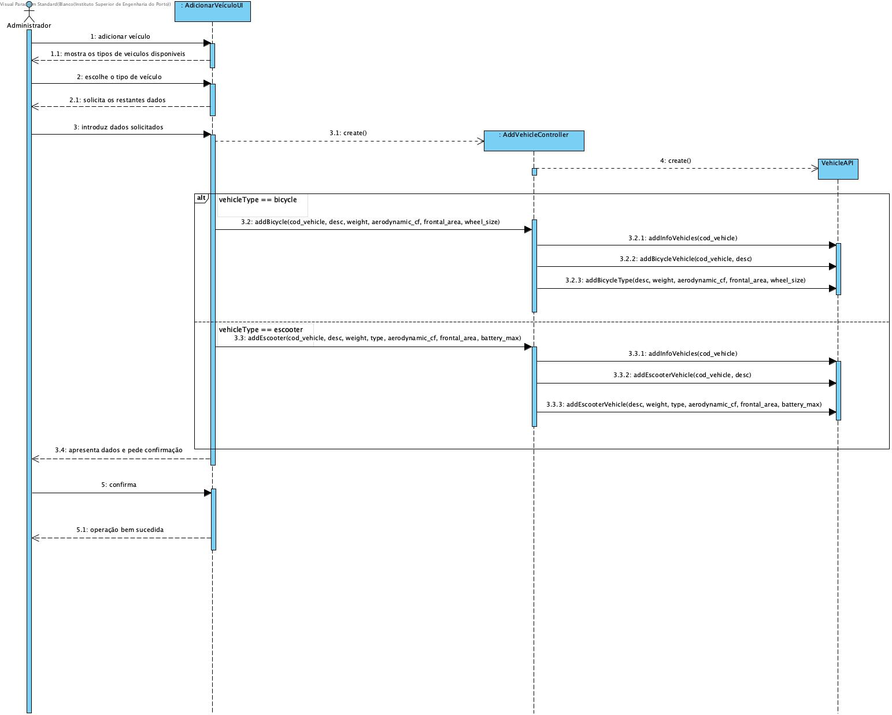
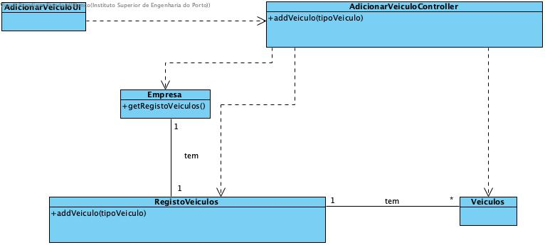

# Adicionar Veículo

## Racional

| Fluxo Principal                                                                                        | Questão: Que Classe...                                      | Resposta                                       | Justificação                                                                                                         |
|:-------------------------------------------------------------------------------------------------------|:------------------------------------------------------------|:-----------------------------------------------|:---------------------------------------------------------------------------------------------------------------------|
| 1. O administrador inicia a adição de um veículo. | ... interage com o utilizador? | AdicionarVeiculoUI                          | Pure Fabrication, pois não se justifica atribuir esta responsabilidade a nenhuma classe existente no Modelo de Domínio. |
|| ... coordena o UC?                                                                              | AdicionarVeiculoController                                | Controller.                                    |                                                                                                                                                                                                            
| 2.	O sistema mostra os tipos de veículos disponíveis. |                  |                                                |                                                                                                                      |
| 3.	O administrador escolhe o tipo de veículo.   | ... guarda os dados introduzidos?                    | Empresa                                     | Information Expert (IE)                                                                                              |
| 4.	 O sistema valida e apresenta os dados e pede confirmação.                                                             | ... valida os dados do veículo (validação local)? | Veículo                                     | IE: Veículo possui os seus próprios dados                                                                                                                   |
|| ... valida os dados do veículo (validação global)?                                           | Empresa                                               | IE: A Empresa contém/agrega veículos |                                                                                                                      |
| 5. O administrador confirma.                                                                     |                                                             |                                                |                                                                                                                      |
| 6. O sistema regista os dados e informa o administrador do sucesso da operação..                           | ... adiciona o veículo?                            | Empresa                                 | IE: A Empresa contém/agrega veículos                                                                 |
|| ... notifica o administrador?                                                                                   | AdicionarVeículoUI                                        |                                                |                                                                                                                      |

## Sistematização ##

 Do racional resulta que as classes conceptuais promovidas a classes de software são:

 * Empresa
 * Veículo
 * Escooter
 * Bicicleta

Outras classes de software (i.e. Pure Fabrication) identificadas:  

 * AdicionarVeiculoUI  
 * AdicionarVeiculoController

##	Diagrama de Sequência

##	Diagrama de Classes

