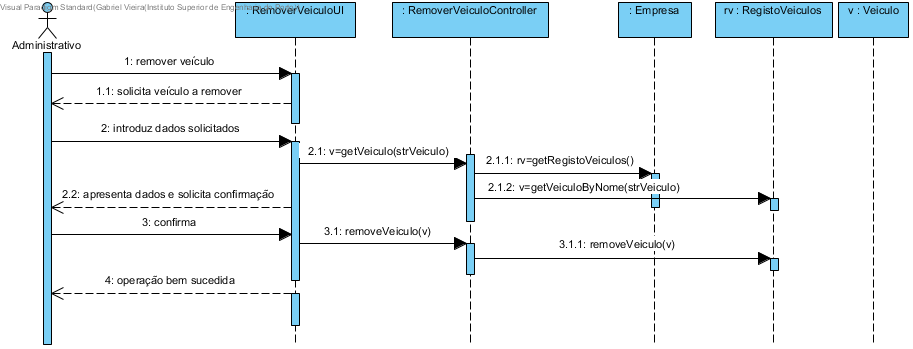
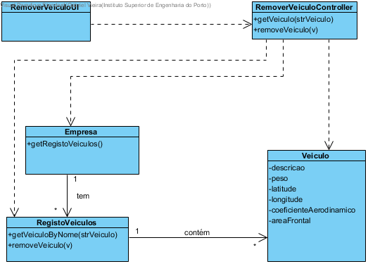

# Realização de UC13 Remover um veículo

## Racional

| Fluxo Principal                                                                                        | Questão: Que Classe...                                      | Resposta                                       | Justificação                                                                                                         |
|:-------------------------------------------------------------------------------------------------------|:------------------------------------------------------------|:-----------------------------------------------|:---------------------------------------------------------------------------------------------------------------------|
| 1. O administrativo inicia a remoção de um veículo. | ... interage com o utilizador? | RemoverVeiculoUI                          | Pure Fabrication, pois não se justifica atribuir esta responsabilidade a nenhuma classe existente no Modelo de Domínio. |
|| ... coordena o UC?                                                                              | RemoverVeiculoController                                | Controller.                                    |                                                                                                                                                                                                            
| 2.	O sistema solicita o veículo a remover. |                  |                                                |                                                                                                                      |
| 3.	O administrativo introduz o veículo a remover.   | ... guarda os dados introduzidos?                    | Empresa                                     | Information Expert (IE)                                                                                              |
| 4.	 O sistema valida e apresenta o veículo a remover ao administrativo, pedindo confirmação.                                                             | ... valida os dados do veiculo (validação local)? | Veiculo                                     | IE: Veiculo possui os seus próprios dados                                                                                                                   |
|| ... valida os dados do veiculo (validação global)?                                           | Empresa                                               | IE: A Empresa contém/agrega veiculos |                                                                                                                      |
| 5. O administrativo confirma.                                                                    |                                                             |                                                |                                                                                                                      |
| 6.	O sistema remove o veículo e informa o administrativo do sucesso da operação.                           | ... remove o veiculo especificado?                            | Empresa                                 | IE: A Empresa contém/agrega veiculos                                                                 |
|| ... notifica o administrativo?                                                                                   | RemoverVeiculoUI                                        |                                                |                                                                                                                      |

## Sistematização ##

 Do racional resulta que as classes conceptuais promovidas a classes de software são:

 * Empresa
 * Veiculo

Outras classes de software (i.e. Pure Fabrication) identificadas:  

 * RemoverVeiculoUI  
 * RemoverVeiculoController

##	Diagrama de Sequência

##	Diagrama de Classes

