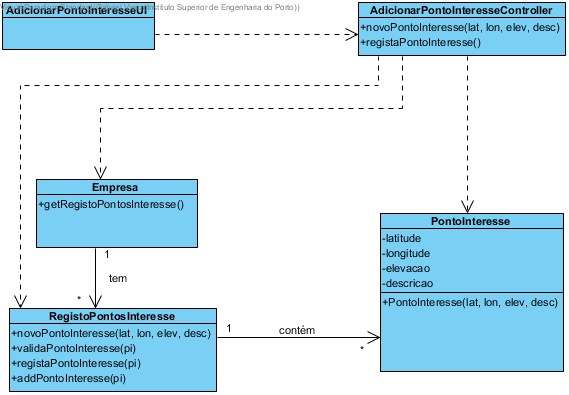

# Realização de UC15 Adicionar pontos de interesse

## Racional

| Fluxo Principal                                                                                        | Questão: Que Classe...                                      | Resposta                                       | Justificação                                                                                                         |
|:-------------------------------------------------------------------------------------------------------|:------------------------------------------------------------|:-----------------------------------------------|:---------------------------------------------------------------------------------------------------------------------|
| 1. O administrativo inicia a adição de ponto de interesse. | ... interage com o utilizador? | AdicionarPontoInteresseUI                          | Pure Fabrication, pois não se justifica atribuir esta responsabilidade a nenhuma classe existente no Modelo de Domínio. |
|| ... coordena o UC?                                                                              | AdicionarPontoInteresseController                                | Controller.                                    |                                                                                                                                                                                                            
| 2.	O sistema solicita os dados a preencher relativos ao ponto de interesse. |                  |                                                |                                                                                                                      |
| 3.	O administrativo introduz os dados.   | ... guarda os dados introduzidos?                    | RegistoPontosInteresse                                     | Information Expert (IE)                                                                                              |
| 4.	O sistema valida e apresenta os dados ao administrativo, pedindo confirmação.                                                             | ... valida os dados do ponto de interesse (validação local)? | PontoInteresse                                     | IE: PontoInteresse possui os seus próprios dados                                                                                                                   |
|| ... valida os dados do ponto de interesse (validação global)?                                           | RegistoPontosInteresse                                               | IE: O RegistoPontosInteresse contém/agrega pontos de interesse |                                                                                                                      |
| 5. O administrativo confirma.                                                                     |                                                             |                                                |                                                                                                                      |
| 6.	O sistema adiciona o ponto de interesse e informa o administrativo do sucesso da operação.                           | ... adiciona o ponto de interesse especificado?                            | RegistoPontosInteresse                                 | IE: O RegistoPontosInteresse contém/agrega pontos de interesse                                                                 |
|| ... notifica o administrativo?                                                                                   | AdicionarPontoInteresseUI                                        |                                                |                                                                                                                      |

## Sistematização ##

 Do racional resulta que as classes conceptuais promovidas a classes de software são:

 * RegistoPontosInteresse
 * PontoInteresse

Outras classes de software (i.e. Pure Fabrication) identificadas:  

 * AdicionarPontoInteresseUI  
 * AdicionarPontoInteresseController

##	Diagrama de Sequência

##	Diagrama de Classes

