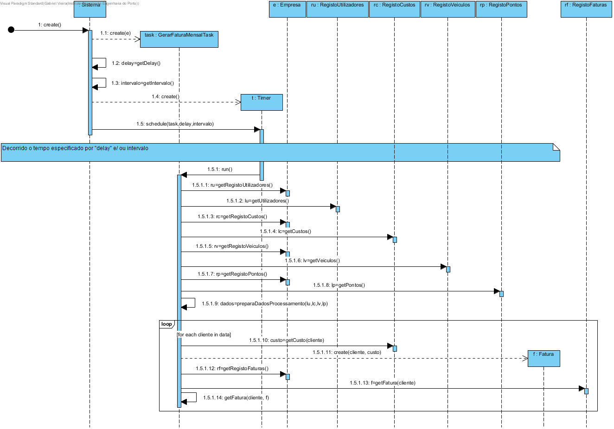

# Realização de UC16 Gerar fatura mensal

## Racional

| Fluxo Principal                                                                                        | Questão: Que Classe...                                      | Resposta                                       | Justificação                                                                                                         |
|:-------------------------------------------------------------------------------------------------------|:------------------------------------------------------------|:-----------------------------------------------|:---------------------------------------------------------------------------------------------------------------------|
| 1. É iniciado o processo de gerar a fatura mensal.|...coordena o UC?|Timer| Controller |
|2. O sistema gera a fatura mensal de acordo com a informação do custo cobrado ao utilizador pela utilização do veículo e dos pontos que o utilizador obtém na sua conta.|...quem gera a fatura?|GerarFaturaMensalTask|Information Expert (IE)|
|3. O sistema notifica o utilizador com a fatura gerada.|...notifica o utilizador?|GerarFaturaMensalTask|Information Expert (IE)|

## Sistematização ##

Do racional resulta que as classes conceptuais promovidas a classes de software são:

* GerarFaturaMensalTask

Outras classes de software (i.e. Pure Fabrication) identificadas:  

 * Timer
 * Empresa
 * RegistoUtilizadores
 * RegistoCustos
 * RegistoVeiculos
 * RegistoPontos

##	Diagrama de Sequência

##	Diagrama de Classes

