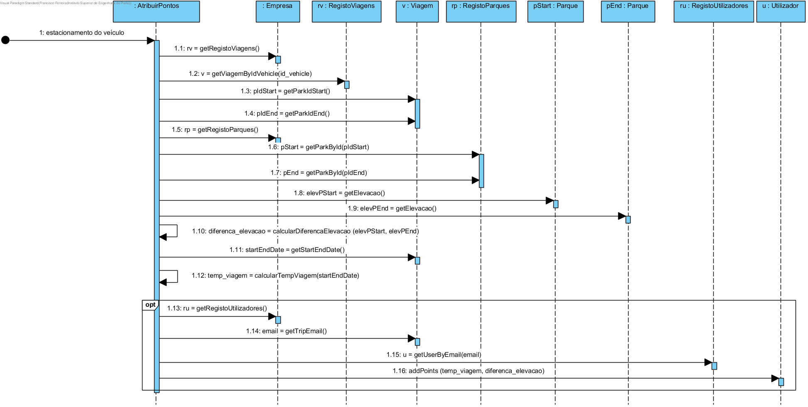
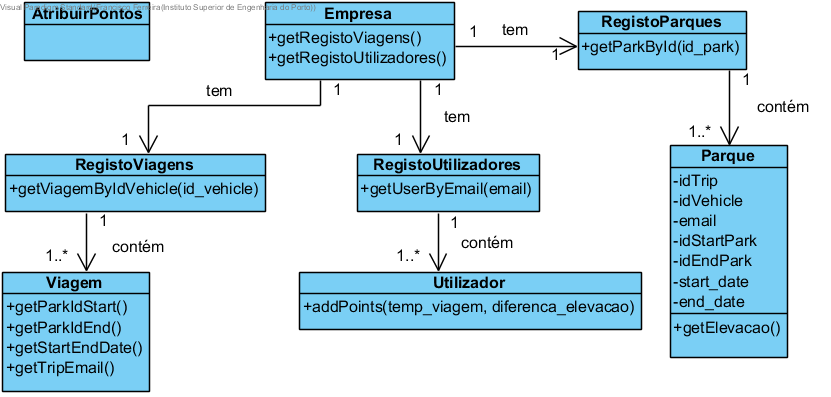

# Realização de UC17 Atribuir pontos

## Racional

| Fluxo Principal                                                                                        | Questão: Que Classe...                                      | Resposta                                       | Justificação                                                                                                         |
|:-------------------------------------------------------------------------------------------------------|:------------------------------------------------------------|:-----------------------------------------------|:---------------------------------------------------------------------------------------------------------------------|
| 1. Assim que um veículo é estacionado, é iniciado o processo de atribuição de pontos ao utilizador.|...coordena o UC?|AtribuirPontosController| Controller |
|2. O sistema atribui os pontos ao utilizador de acordo com a diferença de altitude entre o parque origem e o parque de estacionamento, bem como tendo em conta o tempo de utilização do veículo.|...quem gera a atribuição de pontos?|AtribuirPontos|Information Expert (IE)|

## Sistematização ##

Do racional resulta que as classes conceptuais promovidas a classes de software são:
* Empresa
* AtribuirPontos

Outras classes de software (i.e. Pure Fabrication) identificadas:  

 * AtribuirPontosController

##	Diagrama de Sequência

##	Diagrama de Classes

