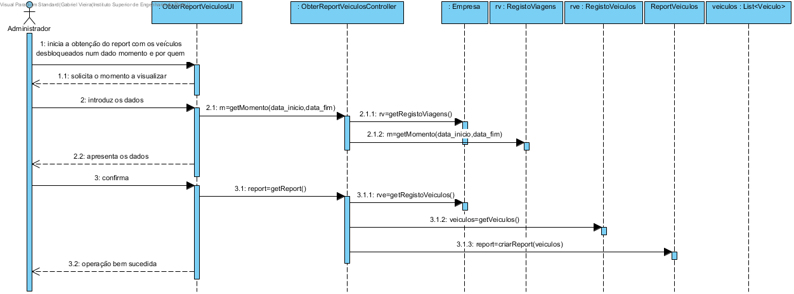
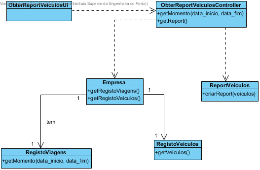

# Realização de UC18 Obter report com os veículos desbloqueados num dado momento e por quem

## Racional

| Fluxo Principal                                                                                        | Questão: Que Classe...                                      | Resposta                                       | Justificação                                                                                                         |
|:-------------------------------------------------------------------------------------------------------|:------------------------------------------------------------|:-----------------------------------------------|:---------------------------------------------------------------------------------------------------------------------|
| 1. O administrativo inicia a obtenção do report com os veículos desbloqueados num dado momento e por quem. | ... interage com o utilizador? | ObterReportVeiculosUI                          | Pure Fabrication, pois não se justifica atribuir esta responsabilidade a nenhuma classe existente no Modelo de Domínio. |
|| ... coordena o UC?                                                                              | ObterReportVeiculosController                                | Controller.                                    |                                                                                                                                                                                                            
| 2.	O sistema solicita o momento a visualizar. |                  |                                                |                                                                                                                      |
| 3.	O administrativo introduz os dados.   | ... guarda os dados introduzidos?                    | ReportVeiculos                                     | Information Expert (IE)                                                                                              |
| 4.	O sistema valida e apresenta os dados ao administrativo, pedindo confirmação.                                                             | ... valida os dados do momento fornecido (validação local)? | Viagem                                     | IE: Viagem possui os seus próprios dados                                                                                                                   |
|| ... valida os dados do momento fornecido (validação global)?                                           | Empresa                                               | IE: A Empresa contém/agrega viagens |                                                                                                                      |
| 5. O administrativo confirma.                                                                     |                                                             |                                                |                                                                                                                      |
| 6.	O sistema gera o report com os veículos desbloqueados num dado momento e por quem, e informa o administrativo do sucesso da operação.                          |                          |                               |                                                                  

## Sistematização ##

 Do racional resulta que as classes conceptuais promovidas a classes de software são:

 * Empresa
 * ReportVeiculos
 * Viagem

Outras classes de software (i.e. Pure Fabrication) identificadas:  

 * ObterReportVeiculosUI  
 * ObterReportVeiculosController

##	Diagrama de Sequência

##	Diagrama de Classes

