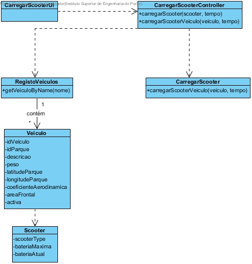

# Realização de UC19 Carregar Scooter

## Racional

| Fluxo Principal                                                                                        | Questão: Que Classe...                                      | Resposta                                       | Justificação                                                                                                         |
|:-------------------------------------------------------------------------------------------------------|:------------------------------------------------------------|:-----------------------------------------------|:---------------------------------------------------------------------------------------------------------------------|
| 1. O administrador inicia a atualização da bateria da scooter. | ... interage com o utilizador? | CarregarScooterUI                          | Pure Fabrication, pois não se justifica atribuir esta responsabilidade a nenhuma classe existente no Modelo de Domínio. |
|| ... coordena o UC?                                                                              | CarregarScooterController                                | Controller.                                    |                                                                                                                                                                                                            
| 2.O sistema solicita os dados necessários (i.e. scooter,tempo). |                  |                                                |                                                                                                                      |
| 3.	O administrador introduz os dados solicitados.   | ... guarda os dados introduzidos?                    | Empresa                                     | Information Expert (IE)                                                                                              |
| 4.	 O sistema valida e apresenta os dados, pedindo que os confirme.                                                             | ... valida os dados da scooter (validação local)? | Scooter                                     | IE: Scooter possui os seus própios atributos.                                                                                                                   |
|| ... valida os dados da Scooter (validação global)?                                           | Empresa                                               | IE: A Empresa contém/agrega Scooters |                                                                                                            |
| 5. O administrativo confirma.                                                                     |                                                             |                                                |                                                                                                                      |
| 6.O sistema atualiza a bateria da scooter.                        | ... atualiza a bateria?                            | Empresa                                 | IE: A Empresa contém/agrega Scooters                                                                |
|| ... notifica o administrativo?                                                                                   | CarregarScooterUI                                        |                                                |                                                                                                                      |

 Do racional resulta que as classes conceptuais promovidas a classes de software são:

 * Empresa
 * Scooter

Outras classe## Sistematização ##

s de software (i.e. Pure Fabrication) identificadas:  

 * CarregarScootersUI  
 * CarregarScooterController

##	Diagrama de Sequência

##	Diagrama de Classes

