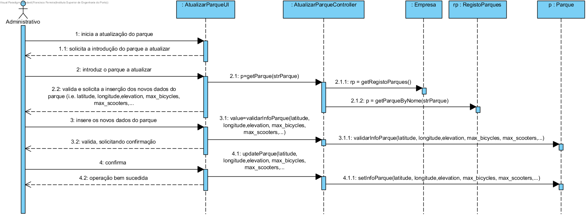

# Realização de UC1 Atualizar um parque

## Racional

| Fluxo Principal                                                                                        | Questão: Que Classe...                                      | Resposta                                       | Justificação                                                                                                         |
|:-------------------------------------------------------------------------------------------------------|:------------------------------------------------------------|:-----------------------------------------------|:---------------------------------------------------------------------------------------------------------------------|
| 1. O administrativo inicia a atualização de um parque. | ... interage com o utilizador? | AtaulizarParqueUI                          | Pure Fabrication, pois não se justifica atribuir esta responsabilidade a nenhuma classe existente no Modelo de Domínio. |
|| ... coordena o UC?                                                                              | AtualizarParqueController                                | Controller.                                    |                                                                                                                                                                                                            
| 2.	O sistema solicita o parque a atualizar. |                  |                                                |                                                                                                                      |
| 3.	O administrativo introduz o parque a atualizar.   | ... guarda os dados introduzidos?                    | Empresa                                     | Information Expert (IE)                                                                                              |
| 4.	 O sistema valida e solicita a inserção dos novos dados do parque.                                                             | ... valida os dados do parque (validação local)? | Parque                                     | IE: Parque possui os seus próprios dados                                                                                                                   |
|| ... valida os dados do parque (validação global)?                                           | Empresa                                               | IE: A Empresa contém/agrega parques |                                                                                                                      |
| 5. O administrativo insere os novos dados do parque.                                                            | 
|												|
											|
| 6. O sistema valida, pedindo confirmação                                   | ... valida os dados do parque (validação local)? | Parque                                     | IE: Parque possui os seus próprios dados                                                                                                                   |
|| ... valida os dados do parque (validação global)?                                           | Empresa                                               | IE: A Empresa contém/agrega parques |                                                                                                                      |
| 7.O administrativo confirma.                                                         | 
|												|
											|
| 7.	O sistema atualiza o parque e informa o administrativo do sucesso da operação.                       | ... atualiza o parque especificado?                            | Empresa                                 | IE: A Empresa contém/agrega parques                                                                 |
|| ... notifica o administrativo?                                                                                   | AtualizarParqueUI                                        |                                                |                                                                                                                      |

## Sistematização ##

 Do racional resulta que as classes conceptuais promovidas a classes de software são:

 * Empresa
 * Parque

Outras classes de software (i.e. Pure Fabrication) identificadas:  

 * AtualizarParqueUI  
 * AtualizarParqueController

##	Diagrama de Sequência

##	Diagrama de Classes

