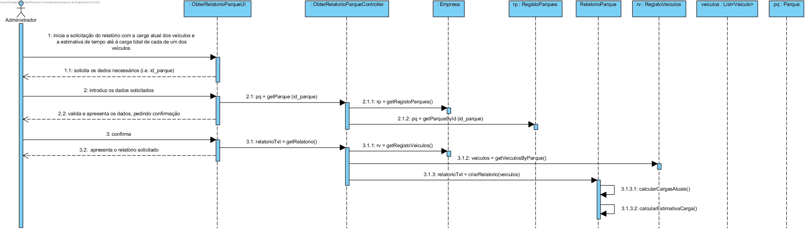

# Realização de UC20 Obter relatório com a carga atual dos veículos e a estimativa de tempo até à carga total de cada de um dos veículos para um parque

## Racional

| Fluxo Principal                                                                                        | Questão: Que Classe...                                      | Resposta                                       | Justificação                                                                                                         |
|:-------------------------------------------------------------------------------------------------------|:------------------------------------------------------------|:-----------------------------------------------|:---------------------------------------------------------------------------------------------------------------------|
| 1. O administrador inicia a solicitação do relatório com a carga atual dos veículos e a estimativa de tempo até à carga total de cada de um dos veículos. | ... interage com o utilizador? | ObterRelatorioParqueUI                          | Pure Fabrication, pois não se justifica atribuir esta responsabilidade a nenhuma classe existente no Modelo de Domínio. |
|| ... coordena o UC?                                                                              | ObterRelatorioParqueController                                | Controller.                                    |                                                                                                                                                                                                            
| 2.	O sistema solicita o parque. |                  |                                                |                                                                                                                      |
| 3.	O administrador introduz os dados solicitados.   | ... guarda os dados introduzidos?                    | RelatorioParque                                     | Information Expert (IE)                                                                                              |
| 4.	 O sistema valida e apresenta os dados ao administrador, pedindo que os confirme.                                                             | ... valida os dados do parque  (validação local)? | Parque                                     | IE: Parque possui os seus próprios dados                                                                                                                   |
|| ... valida os dados do parque (validação global)?                                           | Empresa                                               | IE: A Empresa contém/agrega parques|                                                                                                                      |
| 5. O administrador confirma.                                                                     |                                                             |                                                |                                                                                                                      |
| 6.	O sistema apresenta o relatório solicitado.                                                                       |                                                                                                                      |

## Sistematização ##

 Do racional resulta que as classes conceptuais promovidas a classes de software são:

 * Empresa
 * Parque
 * RelatorioParque

Outras classes de software (i.e. Pure Fabrication) identificadas:  

 * ObterRelatorioParqueUI  
 * ObterRelatorioParqueController

##	Diagrama de Sequência

##	Diagrama de Classes

