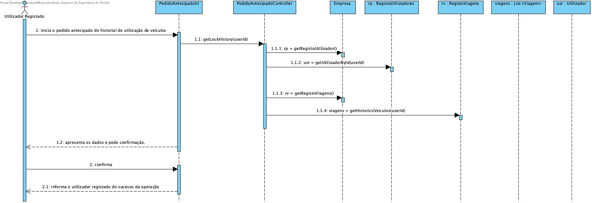
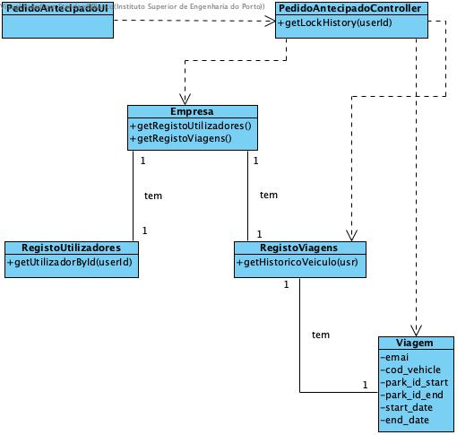

# Pedido Antecipado

## Racional

| Fluxo Principal                                                                                        | Questão: Que Classe...                                      | Resposta                                       | Justificação                                                                                                         |
|:-------------------------------------------------------------------------------------------------------|:------------------------------------------------------------|:-----------------------------------------------|:---------------------------------------------------------------------------------------------------------------------|
| 1. O utilizador registado inicia o pedido antecipado do historial de utilização | ... interage com o utilizador? | PedidoAntecipadoUI                          | Pure Fabrication, pois não se justifica atribuir esta responsabilidade a nenhuma classe existente no Modelo de Domínio. |
|| ... coordena o UC?                                                                              | PedidoAntecipadoController                                | Controller.                                    |                                                                                                                                            
| 2.	 O sistema apresenta os dados e pede confirmação.                                                             |  |                                    |                                                                                                                  |
||                                         |                                           |  |                                                                                                                      |
| 3. O utilizador registado confirma.                                                                     |                                                             |                                                |                                                                                                                      |
| 4. O sistema informa o utilizador registado do sucesso da operação.                        |       |                              |                                                                 |
|| ... notifica o administrador?                                                                                   | AdicionarVeículoUI                                        |                                                |                                                                                                                      |

## Sistematização ##

 Do racional resulta que as classes conceptuais promovidas a classes de software são:

 *Empresa

Outras classes de software (i.e. Pure Fabrication) identificadas:  

 * AdicionarVeiculoUI  
 * AdicionarVeiculoController

##	Diagrama de Sequência

##	Diagrama de Classes

