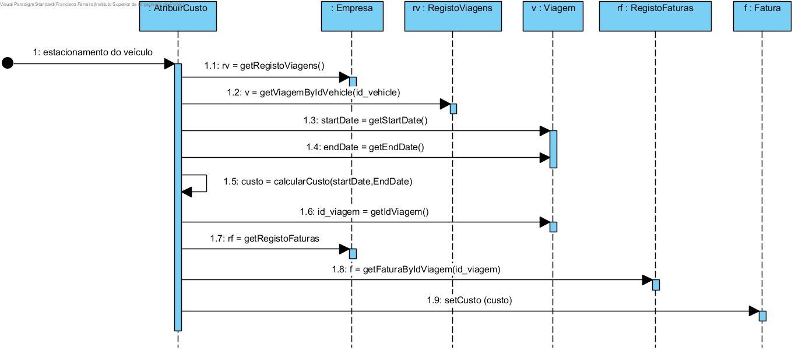
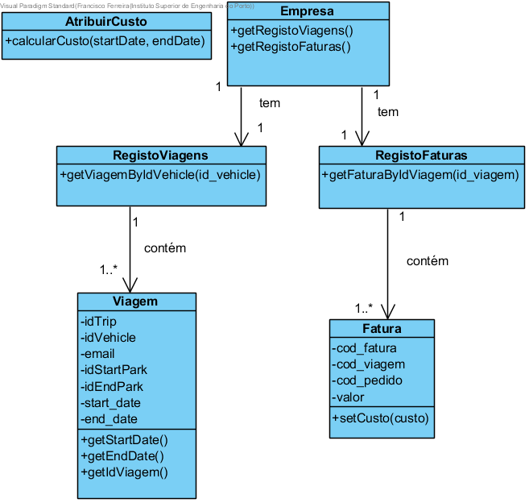

# Realização de UC22 Gerar fatura de utilização de veículo

## Racional

| Fluxo Principal                                                                                        | Questão: Que Classe...                                      | Resposta                                       | Justificação                                                                                                         |
|:-------------------------------------------------------------------------------------------------------|:------------------------------------------------------------|:-----------------------------------------------|:---------------------------------------------------------------------------------------------------------------------|
| 1. Assim que um veículo é estacionado, o processo de geração de fatura de utilização de veículo é iniciado|...coordena o UC?|AtribuirCustoController| Controller |
|2. O sistema gera a fatura de utilização do veículo guardando os dados no sistema. |...quem gera a fatura de utilização do veículo?|AtribuirCusto|Information Expert (IE)|

## Sistematização ##

Do racional resulta que as classes conceptuais promovidas a classes de software são:
* Empresa
* AtribuirCusto

Outras classes de software (i.e. Pure Fabrication) identificadas:  

 * AtribuirCustoController

##	Diagrama de Sequência

##	Diagrama de Classes

