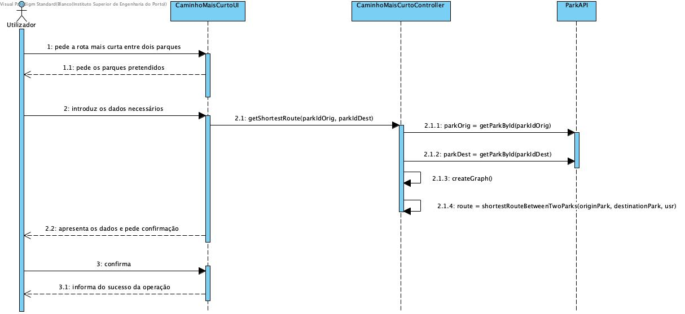
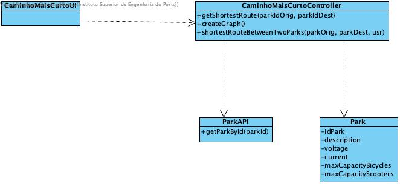

# Caminho Mais Curto

## Racional

| Fluxo Principal                                                                                        | Questão: Que Classe...                                      | Resposta                                       | Justificação                                                                                                         |
|:-------------------------------------------------------------------------------------------------------|:------------------------------------------------------------|:-----------------------------------------------|:---------------------------------------------------------------------------------------------------------------------|
| 1. O utilizador registado pede a rota mais curta entre dois parques. | ... interage com o utilizador? |CaminhoMaisCurtoUI                          | Pure Fabrication, pois não se justifica atribuir esta responsabilidade a nenhuma classe existente no Modelo de Domínio. |
|| ... coordena o UC?                                                                              | CaminhoMaisCurtoController                                | Controller.                                    |                                                                                                                                                                                                            
| 2.	O sistema pede os parques pretendidos. |                  |                                                |                                                                                                                      |
| 3.	O utilizador introduz os dados necessários.   | ... guarda os dados introduzidos?                    | Empresa                                     | Information Expert (IE)                                                                                              |
| 4.	 O sistema valida e apresenta os dados e pede confirmação.                                                             | ... valida os dados do veículo (validação local)? | Parque                                     | IE: Parque possui os seus próprios dados                                                                                                                   |
|| ... valida os dados do veículo (validação global)?                                           | Empresa                                               | IE: A Empresa contém/agrega parques |                                                                                                                      |
| 5. O utilizador confirma.                                                                     |                                                             |                                                |                                                                                                                      |
| 6. O sistema informa o administrador do sucesso da operação..                                                                                        
|| ... notifica o administrador?                                                                                   | CaminhoMaisCurtoUI                                        |                                                |                                                                                                                      |

## Sistematização ##

 Do racional resulta que as classes conceptuais promovidas a classes de software são:

 * Empresa
 * Parque

Outras classes de software (i.e. Pure Fabrication) identificadas:  

 * CaminhoMaisCurtoUI  
 * CaminhoMaisCurtoController

##	Diagrama de Sequência

##	Diagrama de Classes

