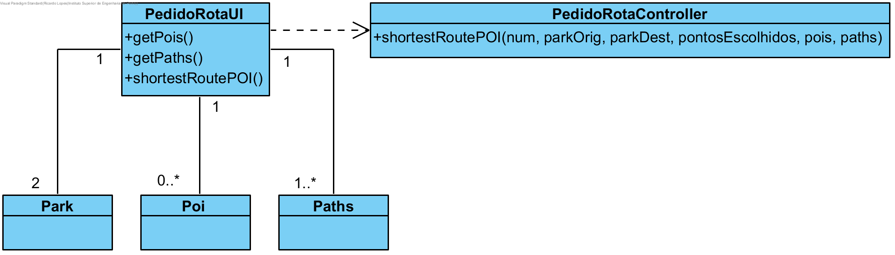

# Realização de UC24 Caminho Mais Curto POI

## Racional

| Fluxo Principal | Questão: Que Classe...  | Resposta | Justificação  |
|:--------|:-----|:-----|:------|
| 1. O utilizador registado inicia o pedido de uma rota. | ... interage com o utilizador? | PedidoRotaUI | Pure Fabrication, pois não se justifica atribuir esta responsabilidade a nenhuma classe existente no Modelo de Domínio. |
|| ... coordena o UC?  | PedidoRotaController | Controller.     
| 2. Confirma a rota | ... interage com o utilizador? | PedidoRotaUI | Pure Fabrication, pois não se justifica atribuir esta responsabilidade a nenhuma classe existente no Modelo de Domínio. |

## Sistematização ##

 Do racional resulta que as classes conceptuais promovidas a classes de software são:

 * POIS
 * Paths
 * Park
 * Path

Outras classes de software (i.e. Pure Fabrication) identificadas:  

 * PedidoRotaUI                               
 * PedidoRotaController                                 

##	Diagrama de Sequência

##	Diagrama de Classes

