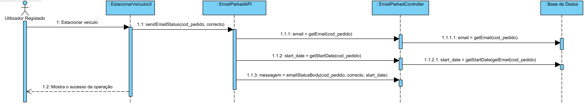
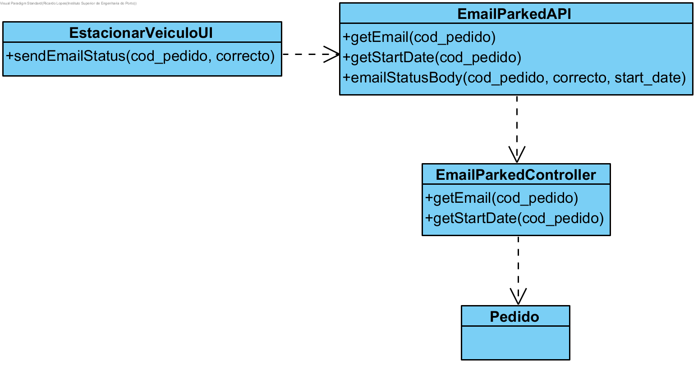

# Realização de UC25 Receber email com o estado do veículo

## Racional

| Fluxo Principal    | Questão: Que Classe...     | Resposta         | Justificação     |
|:-----------------------|:---------------|:-------------|:----------------------|
| 1. O utilizador registado inicia o estacionamento/fim de uma trip. | ... interage com o utilizador? | ParkingVehicleUI| Pure Fabrication, pois não se justifica atribuir esta responsabilidade a nenhuma classe existente no Modelo de Domínio. |
|| ... coordena o UC?                                   | EmailParkedController | Controller                                  
| 2.	O sistema manda o email ao utilizador com o estado do estacionamento ||||
## Sistematização ##

 Do racional resulta que as classes conceptuais promovidas a classes de software são:

 * Pedido

Outras classes de software (i.e. Pure Fabrication) identificadas:  

 * ParkingVehicleUI                                 
 * EmailParkedAPI                                 

##	Diagrama de Sequência

##	Diagrama de Classes

