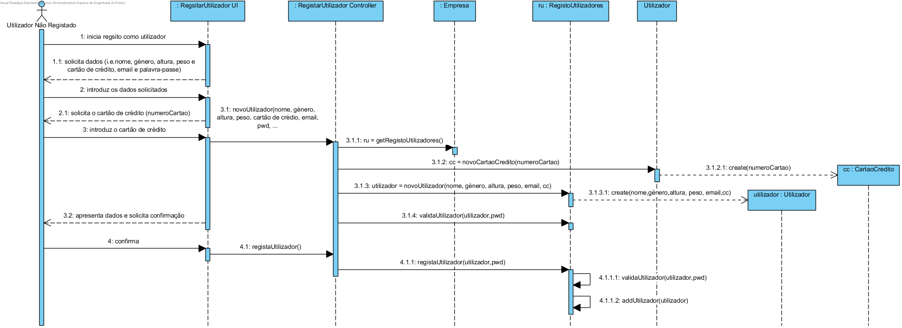

# Realização de UC3 Efetuar Registo Como Utilizador

## Racional

| Fluxo Principal                                                                                        | Questão: Que Classe...                                      | Resposta                                      | Justificação                                                                                                         |
|:-------------------------------------------------------------------------------------------------------|:------------------------------------------------------------|:-----------------------------------------------|:---------------------------------------------------------------------------------------------------------------------|
|1. O utilizador não regsitado inicia o registo como utilizador da aplicação.|... interage com o utilizador não registado?|RegistarUtilizadorUI|PureFabrication|
||...coordena a US?|RegistarUtilizadorController|Controller|
||...cria/instancia Utilizador?|RegistoUtilizadores| HC + LC (about Company) + Creator (Regra 1)|
||...quem conhece o RegistoUtilizadores ?|Empresa| HC + LC |
|2. O sistema solicita os dados necessários (i.e. nome, género, altura, peso e cartão de crédito, email e palavra-passe).| | | |
|3. O utilizador não regsitado introduz os dados solicitados.| ... guarda os dados introduzidos?|Utilizador|Information Expert (IE) - instância criada no passo 1|
|4. O sistema solicita o cartão de crédito.||||
|5. O utilizador não registado introduz o cartão de crédito.|...cria/instancia Cartão de Crédito?|Utilizador|Creator (Regra 4)|
|| ... guarda os dados introduzidos?| CartaoCredito |Information Expert (IE) - instância criada neste passo|
|||
|6. O sistema valida e guarda o cartão de crédito introduzido.|... guarda a instância de Cartão de Crédito criada?| Utilizador|Information Expert (IE) - No MD o utilizador menciona um cartão de crédito |
|7. O sistema valida e apresenta os dados, pedindo que os confirme|...valida os dados do Utilizador (validação local)?|Utilizador|E: Utilizador possui os seus próprios dados|
||...valida os dados do Utilizador (validação global)?|RegistoUtilizadores|IE: O registoUtilizadores contém/agrega Utilizadores|
|8. O utilizador não registado confirma. ||||
|10. O sistema regista os dados de utilizador e informa o utilizador não registado do sucesso da operação. |
|| ... guarda o utilizador registado?  | RegistoUtilizadores | IE. o registoUtilizadores contém/agrega Utilizadores  | 
||... guarda o utilizador deste utilizador registado ?  | AutorizacaoFacade | IE. A gestão de utilizadores é responsabilidade do componente externo respetivo cujo ponto de interação é através da classe "AutorizacaoFacade" |
|| ... notifica o utilizador?  | RegistarUtilizadorUI | |                                               

## Sistematização##

Do racional resulta que as classes conceptuais promovidas a classes de software são:

 * Empresa
 * Cartão de Crédito
 * Utilizador
 * RegistoUtilizadores

Outras classes de software (i.e. Pure Fabrication) identificadas:  

 * RegistarUtilizadoresUI  
 * RegistarUtilizadoresController

##	Sequence Diagram

##	Class Diagram
