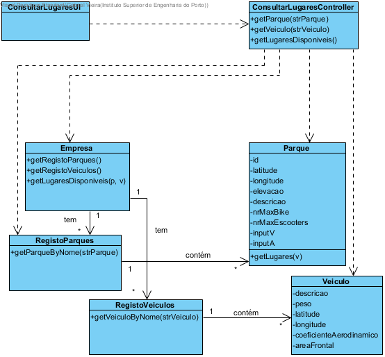

# Realização de UC4 Consultar lugares de estacionamento disponíveis

## Racional

| Fluxo Principal                                                                                        | Questão: Que Classe...                                      | Resposta                                       | Justificação                                                                                                         |
|:-------------------------------------------------------------------------------------------------------|:------------------------------------------------------------|:-----------------------------------------------|:---------------------------------------------------------------------------------------------------------------------|
| 1. O utilizador registado inicia a consulta de lugares de estacionamento livres. | ... interage com o utilizador? | ConsultarLugaresUI                          | Pure Fabrication, pois não se justifica atribuir esta responsabilidade a nenhuma classe existente no Modelo de Domínio. |
|| ... coordena o UC?                                                                              | ConsultarLugaresController                                | Controller.                                    |                                                                                                                                                                                                            
| 2.	O sistema solicita o parque a consultar e o veículo a ser utilizado. |                  |                                                |                                                                                                                      |
| 3.	O administrativo introduz os dados solicitados.   | ... guarda os dados introduzidos?                    | Parque                                     | Information Expert (IE)                                                                                              |
| 4.	 O sistema valida e apresenta os dados ao utilizador registado, pedindo confirmação.                                                             | ... valida os dados do parque e veiculo (validação local)? | Parque                                     | IE: Parque e Veiculo possuem os seus próprios dados                                                                                                                   |
|| ... valida os dados do parque e veiculo (validação global)?                                           | Empresa                                               | IE: A Empresa contém/agrega parques e veiculos|                                                                                                                      |
| 5. O utilizador registado confirma.                                                                     |                                                             |                                                |                                                                                                                      |
| 6.	O sistema apresenta os lugares disponíveis e informa o utilizador registado do sucesso da operação.                           | ... apresenta os lugares disponíveis?                            | Empresa                                 | IE: A Empresa contém/agrega parques                                                                 |
|| ... notifica o administrativo?                                                                                   | ConsultarLugaresUI                                        |                                                |                                                                                                                      |

## Sistematização ##

 Do racional resulta que as classes conceptuais promovidas a classes de software são:

 * Empresa
 * Parque

Outras classes de software (i.e. Pure Fabrication) identificadas:  

 * ConsultarLugaresUI  
 * ConsultarLugaresController

##	Diagrama de Sequência

##	Diagrama de Classes

