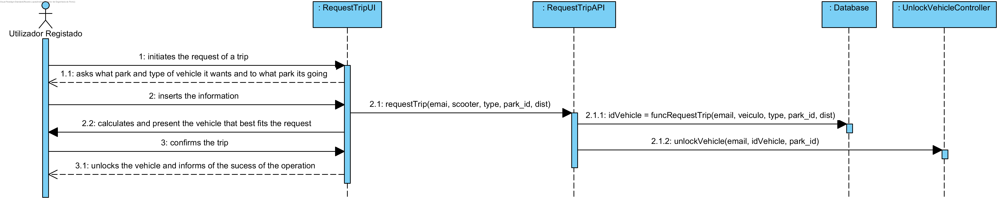
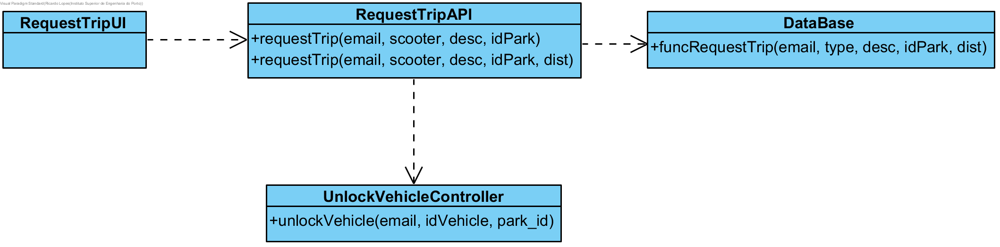

# Realização de UC7 Fazer um pedido

## Racional

| Fluxo Principal                                                                                        | Questão: Que Classe...                                      | Resposta                                       | Justificação                                                                                                         |
|:-------------------------------------------------------------------------------------------------------|:------------------------------------------------------------|:-----------------------------------------------|:---------------------------------------------------------------------------------------------------------------------|
| 1. O utilizador registado inicia o pedido de uma trip. | ... interage com o utilizador? | RequestTripUI                          | Pure Fabrication, pois não se justifica atribuir esta responsabilidade a nenhuma classe existente no Modelo de Domínio. |
|| ... coordena o UC?                                                                              | RequestTripAPI                                | API.                                    |                                                                                                                                                                                                            
| 2.	O sistema solicita o parque de origem, o parque de destino(caso haja) e o tipo de veiculo (bicicleta ou eScooter) |                  |                                                |                                                                                                                      |
| 3.	O utilizador introduz os dados solicitados.   | ... guarda os dados introduzidos?                    | Trip                                     | Information Expert (IE)                                                                                              |
| 4.	 O sistema valida e apresenta os dados ao utilizador registado, pedindo confirmação.                                                             | ... valida os dados do parque e veiculo (validação local)? | Trip                                     | IE: Parque e Veiculo possuem os seus próprios dados                                                                                                                                                                                                                                       |
| 5. O utilizador registado confirma.                                                                     |                                                             |                                                |                                                                                                                      |
| 6.	O sistema apresenta o veiculo que melhor se encaixa ao pedido.                           | ... apresenta o veiculo escolhido?                            | RequestTripAPI                                 | IE: O RequestTripAPI possui o parque calculado                                                                 |                                                                                                     |

## Sistematização ##

 Do racional resulta que as classes conceptuais promovidas a classes de software são:

 * Trip

Outras classes de software (i.e. Pure Fabrication) identificadas:  

 * RequestTripUI                                 
 * RequestTripAPI                                 

##	Diagrama de Sequência

##	Diagrama de Classes

