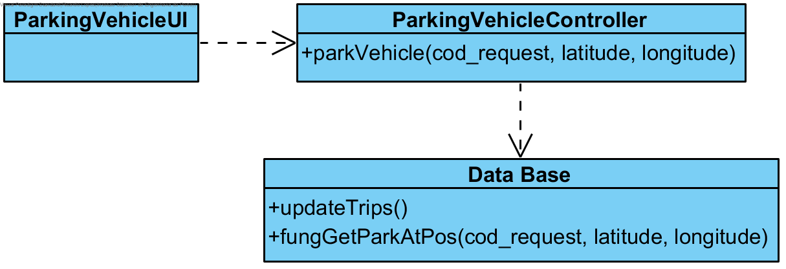

# Realização de UC8 Estacionar um veículo

## Racional

| Fluxo Principal                                                                                        | Questão: Que Classe...                                      | Resposta                                       | Justificação                                                                                                         |
|:-------------------------------------------------------------------------------------------------------|:------------------------------------------------------------|:-----------------------------------------------|:---------------------------------------------------------------------------------------------------------------------|
| 1. O utilizador registado inicia o estacionamento/fim de uma trip. | ... interage com o utilizador? | ParkingVehicleUI| Pure Fabrication, pois não se justifica atribuir esta responsabilidade a nenhuma classe existente no Modelo de Domínio. |
|| ... coordena o UC?                                                                              | ParkingVehicleController                                | Controller.                                    
| 2.	O sistema solicita a localização e o código de pedido |                  |                                                |                                                                                                                      |
| 3.	O utilizador introduz os dados solicitados.   | ... guarda os dados introduzidos?                    | ParkingVehicleController                                     |                                                                                             |
| 4.	 O sistema valida e apresenta os dados ao utilizador registado, pedindo confirmação.                                                             | ... valida os dados do parque e veiculo (validação local)? | ParkingVehicleController|                                                                                                                                                                                                                             |
| 5. O utilizador registado confirma.                                                                     |                                                             |                                                |                                                                                                                      |
| 6.	O sistema bloqueia o veiculo e informa o sucesso da operação                   | ... apresenta o veiculo escolhido?                            | ParkingVehicleController                                 | IE: O ParkingVehicleController                                                               |                                                                                                     |

## Sistematização ##

 Do racional resulta que as classes conceptuais promovidas a classes de software são:

 * Vehicle

Outras classes de software (i.e. Pure Fabrication) identificadas:  

 * ParkingVehicleUI                                 
 * ParkingVehicleController                                 

##	Diagrama de Sequência

##	Diagrama de Classes

