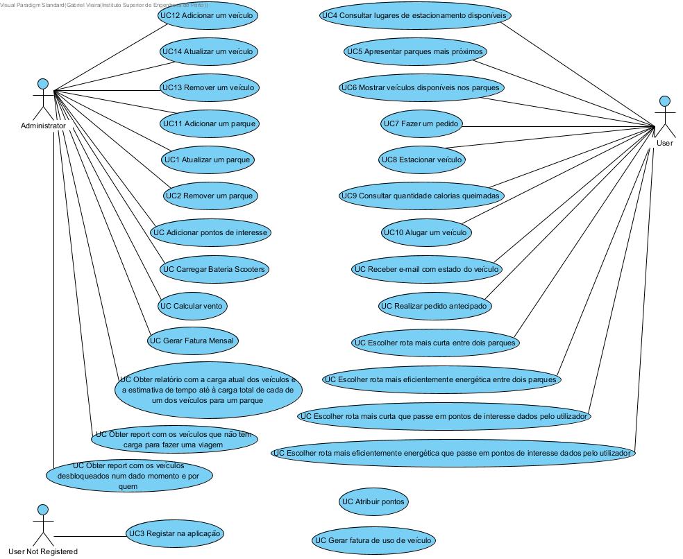

# Use Case Diagram



# Use Cases
| UC  | Description                                                               |                   
|:----|:------------------------------------------------------------------------|
| UC1 | [Atualizar um parque](Use Cases/UC1_Atualizar um parque)  |
| UC2 | [Remover um parque](Use Cases/UC2_Remover um parque)|
| UC3 | [Registar na aplicação](Use Cases/UC3_Registar na aplicação)|
| UC4 | [Consultar lugares de estacionamento disponíveis](Use Cases/UC4_Consultar lugares de estacionamento disponíveis)|
| UC5 | [Apresentar parques mais próximos](Use Cases/UC5_Apresentar parques mais próximos)|
| UC6 | [Mostrar veículos disponíveis nos parques](Use Cases/UC6_Mostrar veículos disponíveis nos parques)|
| UC7 | [Fazer um pedido](Use Cases/UC7_Fazer um pedido)|
| UC8 | [Estacionar veículo](Use Cases/UC8_Estacionar veículo)|
| UC9 | [Consultar quantidade calorias queimadas](Use Cases/UC9_Consultar quantidade calorias queimadas)|
| UC10 | [Alugar um veículo](Use Cases/UC10_Alugar um veículo)|
| UC11 | [Adicionar um parque](Use Cases/UC11_Adicionar um parque)|
| UC12 | [Adicionar um veículo](Use Cases/UC12_Adicionar um veículo)|
| UC13 | [Remover um veículo](Use Cases/UC13_Remover um veículo)|
| UC14 | [Atualizar um veículo](Use Cases/UC14_Atualizar um veículo)|
| UC15 | [Adicionar pontos de interesse](Use Cases/UC15_Adicionar pontos de interesse)|
| UC16 | [Gerar fatura mensal](Use Cases/UC16_Gerar fatura mensal)|
|UC17 | [Atribuir pontos](Use Cases/UC17_Atribuir pontos)|
| UC18 | [Obter report com os veículos desbloqueados num dado momento e por quem](Use Cases/UC18_Obter report com os veículos desbloqueados num dado momento e por quem)|
| UC19 | [Carregar Scooter](Use Cases/UC19_CarregarScooter)|
| UC20 | [Obter relatório com a carga atual dos veículos e a estimativa de tempo até à carga total de cada um dos veículos para um parque](Use Cases/UC20_Obter relatório com a carga atual dos veículos e a estimativa de tempo até à carga total de cada um dos veículos para um parque)|
| UC21 | [Realizar Pedido Antecipado](Use Cases/UC21_RealizarPedidoAntecipado)|
| UC22 | [Gerar fatura de uso de veículo](Use Cases/UC22_Gerar fatura de uso de veiculo)|
