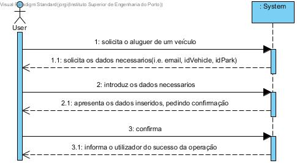

# UC10 - Alugar um veículo

## Formato Breve

O utilizador solicita o aluguer de um veículo. O sistema solicita os dados necessarios(i.e. username, idVehicle, idPark). O utilizador introduz os dados necessarios. O sistema apresenta os dados inseridos, pedindo confirmação. O utilizador confirma. O sistema informa o utilizador do sucesso da operação. (Apenas um veículo pode estar desbloqueado por um utilizador)

## SSD

## Formato Completo

### Ator principal

Administrativo

### Partes interessadas e seus interesses
* **Utilizador:** pretende alugar um veículo.
* **Empresa:** pretende que os utilizadores aluguem veiculos.

### Pré-condições
O veículo tem de estar registado no sistema e não pode estar em uso.

### Pós-condições
O veículo fica em uso.

## Cenário de sucesso principal (ou fluxo básico)

1. O utilizador solicita o aluguer de um veículo.
2. O sistema solicita os dados necessarios(i.e. username, idVehicle, idPark).
3. O utilizador introduz os dados necessarios.
4. O sistema apresenta os dados inseridos, pedindo confirmação.
5. O utilizador confirma. 
6. O sistema informa o utilizador do sucesso da operação.

### Extensões (ou fluxos alternativos)

a. O utilizador solicita o cancelamento do aluguer de um veículo.

> O caso de uso termina.

4a. Dados mínimos obrigatórios em falta.
>	1. O sistema informa quais os dados em falta.
>	2. O sistema permite a introdução dos dados em falta (passo 3)
>
	>	2a. O utilizador não altera os dados. O caso de uso termina.

4b. O sistema detecta que os dados introduzidos (ou algum subconjunto dos dados) são inválidos.
> 1. O sistema alerta o utilizador para o facto. 
> 2. O sistema permite a sua alteração (passo 3).
> 
	> 2a. O utilizador não altera os dados. O caso de uso termina. 

### Requisitos especiais
\-

### Lista de Variações de Tecnologias e Dados
\-

### Frequência de Ocorrência
\-

### Questões em aberto
\-