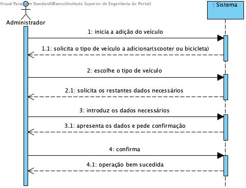

# Adicionar Veículo

## Formato Breve

O administrador inicia a adição do veículo. O sistema solicita o tipo de veículo a adicionar (i.e. scooter ou bicicleta). O administrador escolhe o tipo de veículo. O sistema solicita os restantes dados necessários. O administrador introduz os dados necessários. O sistema apresenta os dados e pede confirmação. O administrador confirma. O sistema regista os dados e informa o administrador do sucesso da operação.

## SSD

## Formato Completo

### Ator Principal

Administrador

### Partes interessadas seus interesses

* **Administrador:** pretende adicionar veículos ao sistema.
* **Empresa:** pretende que os seus clientes tenham veículos disponíveis para serem usados.

### Pré-Condições
n/a

### Pós-Condições
Os veículos são registados no sistema.

### Cenário de sucesso principal (ou fluxo básico)

1. O administrador inicia a adição do veículo. 
2. O sistema solicita o tipo de veículo a adicionar (i.e. scooter ou bicicleta). 
3. O administrador escolhe o tipo de veículo. 
4. O sistema solicita os restantes dados necessários. 
5. O administrador introduz os dados necessários. 
6. O sistema valida e apresenta os dados e pede confirmação. 
7. O administrador confirma. 
8. O sistema regista os dados e informa o administrador do sucesso da operação. 

### Extensões

*a. O administrador solicita o cancelamento da adição do veículo.

> O caso de uso termina.

*6a. Dados mínimos obrigatorios em falta.
>		1. O sistema informa quais os dados em falta.
>		2. O sistema permite a introdução dos dados em falta.
>
        >		2a. O administrador não altera os dados. O caso de uso termina.

*6b. O sistema deteta que os dados introduzidos são inválidos.
>		1. O sistema alerta o utilizador registado para o facto.
>		2. O sistema permite a sua alteração.
>
		>		2a. O administrador registado não altera os dados. O caso de uso termina.

### Requisitos Especiais
\-

### Lista de Variações
\-

### Frequência de Ocorrência
\-

### Questões em Aberto
\-