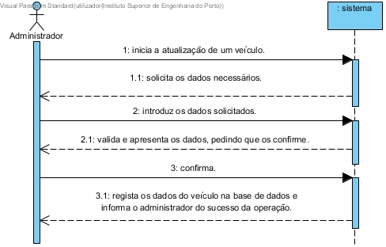

# UC14 - Atualizar um veículo

## Formato Breve

O administrador inicia a atualização de um veículo. O sistema solicita os dados necessários. O administrador introduz os dados solicitados. O sistema valida e apresenta os dados, pedindo que os confirme. O administrador confirma. O sistema **regista os dados do veículo na base de dados** e informa o administrador do sucesso da operação.

## SSD

## Formato Completo

### Ator principal

Administrador

### Partes interessadas e seus interesses
* **Administrador:** pretende registar um novo veículo.
* **Empresa:** pretende a adição do maior número de veículos.

### Pré-condições
n/a

### Pós-condições
A informação da atualização é guardada no sistema.

## Cenário de sucesso principal (ou fluxo básico)

1. O administrador inicia a atualização de um veículo.
2. O sistema solicita os dados necessários.
3. O administrador introduz os dados solicitados.
4. O sistema valida e apresenta os dados, pedindo que os confirme.
5. O administrador confirma.
6. O sistema **atualiza os dados do veículo na base de dados** e informa o administrador do sucesso da operação.

### Extensões (ou fluxos alternativos)

*a. O administrador solicita o cancelamento do registo.

> O caso de uso termina.

	
4a. Dados mínimos obrigatórios em falta.
>	1. O sistema informa quais os dados em falta.
>	2. O sistema permite a introdução dos dados em falta (passo 3).
>
	>	2a. O administrador não altera os dados. O caso de uso termina.

4b. O sistema deteta que os dados (ou algum subconjunto dos dados) introduzidos devem ser únicos e que já existem no sistema.
>	1. O sistema alerta o administrador não registado para o facto.
>	2. O sistema permite a sua alteração (passo 3)
>
	>	2a. O administrador não altera os dados. O caso de uso termina.

4c. O sistema detecta que os dados introduzidos (ou algum subconjunto dos dados) são inválidos.
> 1. O sistema alerta o administrador não registado para o facto. 
> 2. O sistema permite a sua alteração (passo 3).
> 
	> 2a. O administrador não altera os dados. O caso de uso termina. 

### Requisitos especiais
\-

### Lista de Variações de Tecnologias e Dados
\-

### Frequência de Ocorrência
\-

### Questões em aberto