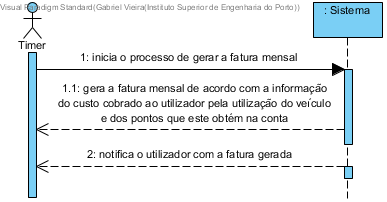

# UC16 - Gerar fatura mensal

## Formato Breve

É iniciado o processo de gerar a fatura mensal. O sistema gera a fatura mensal de acordo com a informação do custo cobrado ao utilizador pela utilização do veículo e dos pontos que o utilizador obtém na sua conta. O sistema notifica o utilizador com a fatura gerada.

## SSD

## Formato Completo

### Ator principal

Timer

### Partes interessadas e seus interesses
* **Utilizador:** pretende que seja notificado com a fatura gerada.
* **Empresa:** pretende que as faturas sejam geradas com sucesso para os respetivos utilizadores.

### Pré-condições
O período de execução deste processo deve acontecer no dia 5 de cada mês.

### Pós-condições
O utilizador é notificado com a fatura gerada.

## Cenário de sucesso principal (ou fluxo básico)

1. É iniciado o processo de gerar a fatura mensal.
2. O sistema gera a fatura mensal de acordo com a informação do custo cobrado ao utilizador pela utilização do veículo e dos pontos que o utilizador obtém na sua conta.  
3. O sistema notifica o utilizador com a fatura gerada.

### Extensões (ou fluxos alternativos)

2a. Não existem alugueres de veículos por parte do utilizador definidos no sistema.
> O sistema informa de tal facto. O caso de uso termina.

### Requisitos especiais
\-

### Lista de Variações de Tecnologias e Dados
\-

### Frequência de Ocorrência
\-

### Questões em aberto
\-