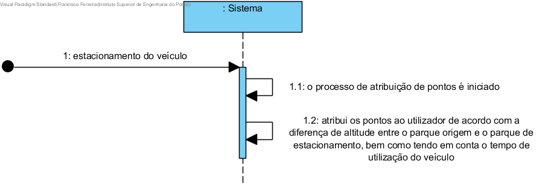

# Atribuir pontos

## Formato Breve

Assim que um veículo é estacionado, o processo de atribuição de pontos é iniciado. O sistema atribui os pontos ao utilizador de acordo com a diferença de altitude entre o parque origem e o parque de estacionamento, bem como tendo em conta o tempo de utilização do veículo. 

## SSD

## Formato Completo

### Ator Principal

Sistema

###  Partes interessadas e seus interesses
* **Utilizador:** pretende que os seus pontos estejam atualizados, de modo a puder usufruir dos mesmos.
* **Empresa:**  pretende que a informação relativa aos pontos dos utilizadores esteja atualizada.

### Pré-condições
Um veículo tem de ser estacionado.

### Pós-condições

A nova informação dos pontos é guardada nos sistema.

## Cenário de sucesso principal (ou fluxo básico)

1. Assim que um veículo é estacionado, o processo de atribuição de pontos é iniciado.
2. O sistema atribui os pontos ao utilizador de acordo com a diferença de altitude entre o parque origem e o parque de estacionamento, bem como tendo em conta o tempo de utilização do veículo. 

### Extensões (ou fluxos alternativos)

*a. O administrativo solicita o concelamento da ataulização do parque.
> A user story termina.

**4a. Dá-se o cancelamento do estacionamento do veículo no parque**
>	1. O sistema informa para tal facto.
>	
	>	2a.  O caso de uso termina.

### Requisitos especiais
\-

### Lista de Variações de Tecnologias e Dados
\-

### Frequência de Ocorrência
	Sempre que um veículo é estacionado num parque.

### Questões em aberto
\-