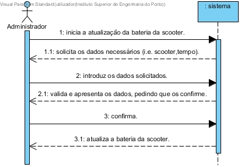

# UC19 - Carregar Scooter

## Formato Breve

O administrador inicia a atualização da bateria da scooter. O sistema solicita os dados necessários (i.e. scooter,tempo). O administrador introduz os dados solicitados. O sistema valida e apresenta os dados, pedindo que os confirme. O administrador confirma. O sistema atualiza a bateria da scooter.

## SSD

## Formato Completo

### Ator principal

Administrador

### Partes interessadas e seus interesses
* **Administrador:** pretende carregar a bateria de um scooter.
* **Empresa:** pretende que as scooters tenham a bateria atualizada.

### Pré-condições
n/a

### Pós-condições
n/a

## Cenário de sucesso principal (ou fluxo básico)

1. O administrador inicia a atualização da bateria da scooter.
2. O sistema solicita os dados necessários (i.e. scooter,tempo).
3. O administrador introduz os dados solicitados.
4. O sistema valida e apresenta os dados, pedindo que os confirme.
5. O administrador confirma.
6. O sistema atualiza a bateria da scooter.

### Extensões (ou fluxos alternativos)

*a. O administtrativo solicita o cancelamento das informações.

> O caso de uso termina.

	
4a. Dados mínimos obrigatórios em falta.
>	1. O sistema informa quais os dados em falta.
>	2. O sistema permite a introdução dos dados em falta (passo 3).
>
	>	2a. O administrativo não altera os dados. O caso de uso termina.

4b. O sistema detecta que os dados introduzidos (ou algum subconjunto dos dados) são inválidos.
> 1. O sistema alerta o administrativo para o facto. 
> 2. O sistema permite a sua alteração (passo 3).
> 
	> 2a. O administrativo não altera os dados. O caso de uso termina. 

### Requisitos especiais
\-

### Lista de Variações de Tecnologias e Dados
\-

### Frequência de Ocorrência
\-

### Questões em aberto