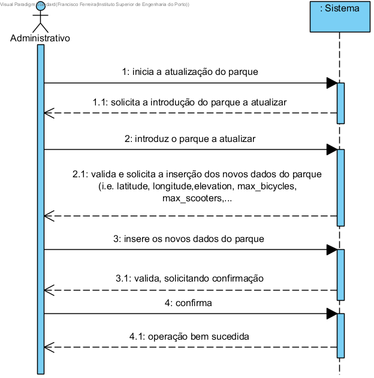

# UC1 - Atualizar um parque

## Formato Breve

O administrativo inicia a atualização do parque. O sistema solicita a introdução do parque a atualizar. O administrativo introduz o parque a atualizar. O sistema valida e solicita a inserção dos novos dados do parque (i.e.  latitude, longitude,elevation, max_bicycles, max_scooters,...). O administrativo insere os novos dados do parque. O sistema valida, pedindo confirmação. O administrativo confirma. O sistema atualiza o parque e informa o administrativo do sucesso da operação.

## SSD

## Formato Completo

### Ator Principal

Administrativo

###  Partes interessadas e seus interesses
* **Administrativo:** pretende atualizar um parque do sistema.
* **Utilizador:** pretende que a informação acerca dos parques esteja atualizada.
* **Empresa:**  pretende que a informação relativa aos parques esteja atualizada.

### Pré-condições
O parque tem de estar registado no sistema.

### Pós-condições

A nova informação do parque é guardada nos sistema.

## Cenário de sucesso principal (ou fluxo básico)

1. O administrativo inicia a atualização do parque.
2. O sistema solicita a introdução do parque a atualizar.
3. O administrativo introduz o parque a atualizar. 
4. O sistema valida e solicita a inserção dos novos dados do parque.
5. O administrativo insere os novos dados do parque.
6. O sistema valida, pedindo confirmação
7. O administrativo confirma.
8. O sistema atualiza o parque e informa o administrativo do sucesso da operação.

### Extensões (ou fluxos alternativos)

*a. O administrativo solicita o concelamento da ataulização do parque.
> A user story termina.

**4a. Dados mínimos obrigatórios em falta.**
>	1. O sistema informa quais os dados em falta.
>	2. O sistema permite a introdução de novos dados (passo 3)
>
	>	2a. O administrativo não altera os dados. O caso de uso termina.

**4b. O sistema detecta que os dados introduzidos (ou algum subconjunto dos dados) são inválidos.**
>	1. O sistema alerta o administrativo para o facto. 
>	2. O sistema permite a sua alteração (passo 3).
>
	>	2a. O administrativo não altera os dados. O caso de uso termina.

**6a. Dados mínimos obrigatórios em falta.**
>	1. O sistema informa quais os dados em falta.
>	2. O sistema permite a introdução de novos dados (passo 5)
>
	>	2a. O administrativo não altera os dados. O caso de uso termina.

**6b. O sistema detecta que os dados introduzidos (ou algum subconjunto dos dados) são inválidos.**
>	1. O sistema alerta o administrativo para o facto. 
>	2. O sistema permite a sua alteração (passo 5).
>
	>	2a. O administrativo não altera os dados. O caso de uso termina.

### Requisitos especiais
\-

### Lista de Variações de Tecnologias e Dados
\-

### Frequência de Ocorrência
\-

### Questões em aberto
\-