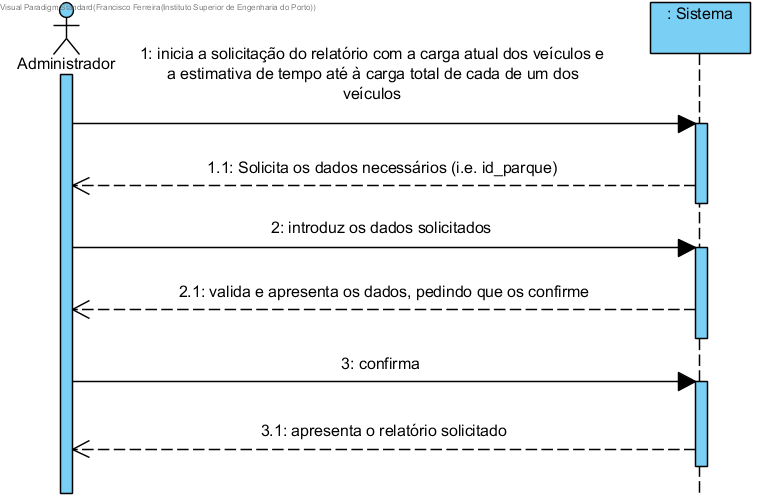

# Obter relatório com a carga atual dos veículos e quanto tempo estes demoram a estar totalmente carregados

## Formato Breve
O administrador inicia a solicitação do relatório com a carga atual dos veículos e a estimativa de tempo até à carga total de cada de um dos veículos, para um parque. O sistema solicita o parque. O administrador introduz os dados solicitados. O sistema valida e apresenta os dados, pedindo ao administrador que os confirme. O administrador confirma. O sistema apresenta o relatório solicitado. 

## SSD

## Formato Completo

### Ator Principal

Administrador

###  Partes interessadas e seus interesses
* **Administrador:** pretende ver o relatório com as informações de carga dos veículos do parque, de modo a constatar sobre o estado desse parque.

### Pré-condições
O parque solicitado tem de estar registado na base de dados.

### Pós-condições
n/a

## Cenário de sucesso principal (ou fluxo básico)

1. O administrador inicia a solicitação do relatório com a carga atual dos veículos e a estimativa de tempo até à carga total de cada de um dos veículos, para um parque.
2. O sistema solicita o parque. O administrador introduz os dados solicitados.
3. O administrador introduz os dados solicitados. 
4. O sistema valida e apresenta os dados, pedindo ao administrador que os confirme.
5. O administrador confirma.
6. O sistema apresenta o relatório solicitado. 

### Extensões (ou fluxos alternativos)

*a. O administrador solicita o concelamento da obtenção do relatório.
> A user story termina.
	
4a. Dados mínimos obrigatórios em falta.
>	1. O sistema informa quais os dados em falta.
>	2. O sistema permite a introdução dos dados em falta (passo 3)
>
	>	2a. O administrador não altera os dados. A user story termina.

4b. O sistema deteta que os dados introduzidos (ou algum subconjunto dos dados) são inválidos.
> 1. O sistema alerta o utilizador não registado para o facto.. 
> 2. O sistema permite a sua alteração (passo 3).
> 
	> 2a. O administrador não altera os dados. A user story termina.

### Requisitos especiais
\-

### Lista de Variações de Tecnologias e Dados
\-

### Frequência de Ocorrência
\-

### Questões em aberto
\-