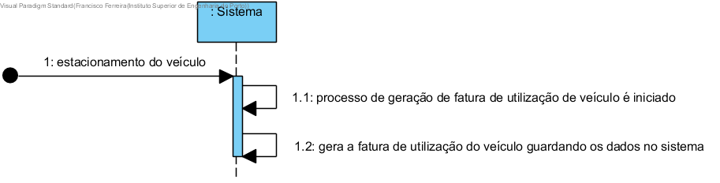

# Gerar fatura de uso de veículo

## Formato Breve

Assim que um veículo é estacionado, o processo de geração de fatura de utilização de veículo é iniciado. O sistema gera a fatura de utilização do veículo guardando os dados no sistema. 

## SSD

## Formato Completo

### Ator Principal

Sistema

###  Partes interessadas e seus interesses
* **Utilizador:** pretende adquirir a fatura de pagamento da utilização de um veículo, de modo a puder visualizar os seus gastos.
* **Empresa:**  pretende que a informação relativa às faturas de utilização de veículos esteja atualizada.

### Pré-condições
Um veículo tem de ser estacionado.

### Pós-condições

A informação da fatura é guardada nos sistema.

## Cenário de sucesso principal (ou fluxo básico)

1. Assim que um veículo é estacionado, o processo de geração de fatura de utilização de veículo é iniciado.
2. O sistema gera a fatura de utilização do veículo guardando os dados no sistema. 

### Extensões (ou fluxos alternativos)

*a. O administrativo solicita o concelamento da geração da fatura.
> A user story termina.

**4a. Dá-se o cancelamento do estacionamento do veículo no parque**
>	1. O sistema informa para tal facto.
>	
	>	2a.  O caso de uso termina.

### Requisitos especiais
\-

### Lista de Variações de Tecnologias e Dados
\-

### Frequência de Ocorrência
Sempre que um veículo é estacionado num parque.

### Questões em aberto
\-