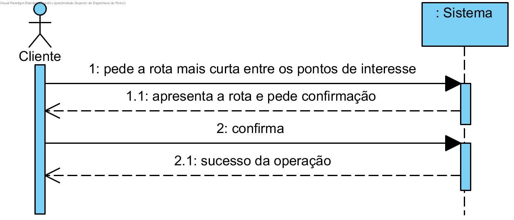

# Caminho mais curto

## Formato Breve

O utilizador registado pede a rota mais curta entre dois parques que passe num numero minimo de pontos de interesse, sendo estes possivel escolhidos pelo utilizador. O sistema apresenta os dados e pede confirmação. O utilizador registado confirma. O sistema informa o utilizador registado do sucesso da operação.

## SSD

## Formato Completo

### Ator Principal

Utilizador Registado

### Partes interessadas seus interesses

* **Utilizador Registado:** pretende saber o caminho mais curto entre dois parques.
* **Empresa:** pretende que os seus clientes tenham conhecimento de diferentes rotas.

### Pré-Condições
n/a

### Pós-Condições
n/a

### Cenário de sucesso principal (ou fluxo básico)

1. O utilizador registado pede a rota mais curta entre dois parques e diz quantos e que pontos quer passar. 
2. O sistema apresenta os dados e pede confirmação. 
3. O utilizador registado confirma. 
4. O sistema informa o utilizador registado do sucesso da operação.

### Extensões

*a. O utilizador registado solicita o pedido do caminho mais curto que passe nos pontos selecionados.

> O caso de uso termina.

### Requisitos Especiais
\-

### Lista de Variações
\-

### Frequência de Ocorrência
\-

### Questões em Aberto
\-