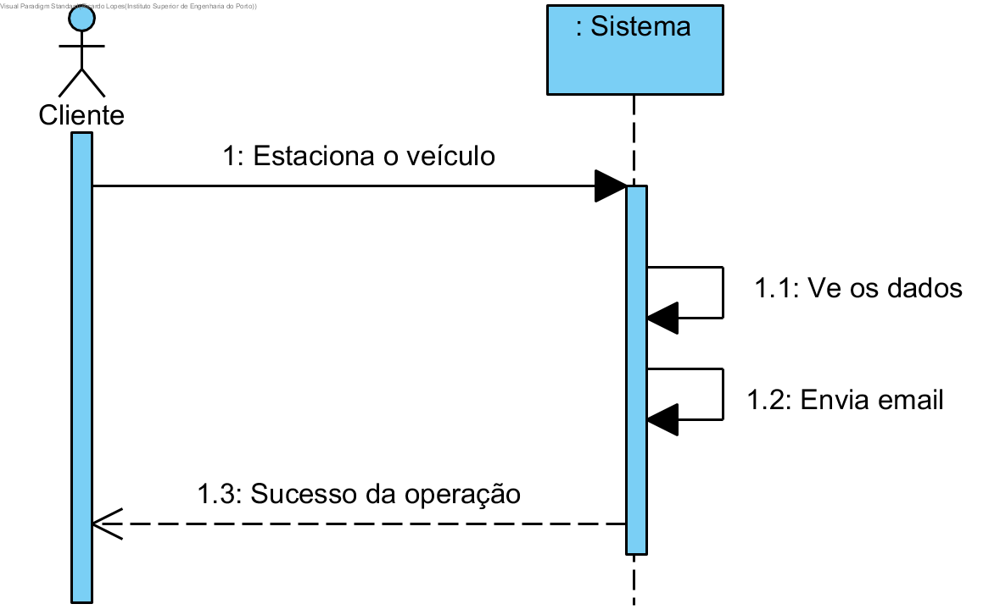

# Receber email com o estado do veículo

## Formato Breve

O utilizador registado estaciona o veículo. O sistema calcula e detecta o bom estacionamento do veiculo. O sistema manda um emial ao utilizador registado com os dados de sucesso da operação.

## SSD

## Formato Completo

### Ator Principal

Utilizador Registado

### Partes interessadas seus interesses

* **Utilizador Registado:** pretende receber o email com o estado do veículo.
* **Empresa:** pretende que os seus clientes tenham conhecimento do estado do veículo.

### Pré-Condições
n/a

### Pós-Condições
n/a

### Cenário de sucesso principal (ou fluxo básico)

1. O utilizador registado dá o percurso como terminado.
2. O sistema calcula e manda email com o estado do veículo
4. O sistema informa o utilizador do sucesso da operação

### Extensões

*a. O utilizador registado solicita o estado do estacionamento do veículo.

> O caso de uso termina.

### Requisitos Especiais
\-

### Lista de Variações
\-

### Frequência de Ocorrência
\-

### Questões em Aberto
\-