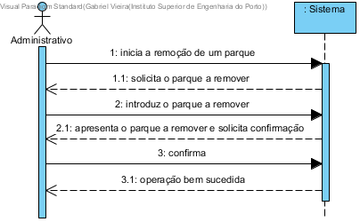

# UC2 - Remover um parque

## Formato Breve

O administrativo inicia a remoção de um parque. O sistema solicita o parque a remover. O administrativo introduz o parque a remover. O sistema valida e apresenta o parque a remover ao administrativo, pedindo confirmação. O administrativo confirma. O sistema remove o parque e informa o administrativo do sucesso da operação.

## SSD

## Formato Completo

### Ator principal

Administrativo

### Partes interessadas e seus interesses
* **Administrativo:** pretende remover um parque do sistema.
* **Utilizador:** pretende não utilizar parques que já não existem.
* **Empresa:** pretende que a informação relativa aos parques esteja atualizada.

### Pré-condições
O parque tem de estar registado no sistema.

### Pós-condições
A informação do parque é removida do sistema.

## Cenário de sucesso principal (ou fluxo básico)

1. O administrativo inicia a remoção de um parque.
2. O sistema solicita o parque a remover.
3. O administrativo introduz o parque a remover.
4. O sistema valida e apresenta o parque a remover ao administrativo, pedindo confirmação.
5. O administrativo confirma.
6. O sistema remove o parque e informa o administrativo do sucesso da operação.

### Extensões (ou fluxos alternativos)

a. O administrativo solicita o cancelamento da remoção do parque.

> O caso de uso termina.

4a. Dados mínimos obrigatórios em falta.
>	1. O sistema informa quais os dados em falta.
>	2. O sistema permite a introdução dos dados em falta (passo 3)
>
	>	2a. O administrativo não altera os dados. O caso de uso termina.

4b. O sistema detecta que os dados introduzidos (ou algum subconjunto dos dados) são inválidos.
> 1. O sistema alerta o administrativo para o facto. 
> 2. O sistema permite a sua alteração (passo 3).
> 
	> 2a. O administrativo não altera os dados. O caso de uso termina. 

### Requisitos especiais
\-

### Lista de Variações de Tecnologias e Dados
\-

### Frequência de Ocorrência
\-

### Questões em aberto
\-