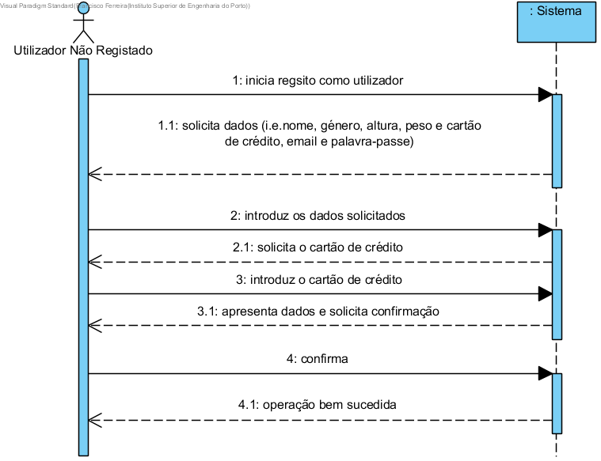

# Efetuar Registo Como Utilizador

## Formato Breve

O utilizador não registado inicia o registo como utilizador da aplicação. O sistema solicita os dados necessários (i.e. nome, género, altura, peso e cartão de crédito, email e palavra-passe). O utilizador não regsitado introduz os dados solicitados. O sistema valida e apresenta os dados, pedindo que os confirme. O utilizador não registado confirma. O sistema regista os dados de utilizador da aplicação, informando o mesmo do sucesso da operação.

## SSD

## Formato Completo

### Ator Principal

Utilizador Não Registado

###  Partes interessadas e seus interesses
* **Utilizador Não Registado:** pretende registar-se de modo a que possa usufruir dos serviços prestados pela empresa.
* **Empresa:**  pretende que a pessoa em causa se torne utilizador de modo a solicitar serviços.

### Pré-condições
n/a

### Pós-condições

A informação do registo é guardada no sistema

## Cenário de sucesso principal (ou fluxo básico)

1. O utilizador não registado inicia o registo como cliente.
2. O sistema solicita os dados necessários (i.e. nome, género, altura, peso, email e palavra-passe).
3. O utilizador não registado introduz os dados solicitados. 
4. O sistema solicita o cartão de crédito.
5. O utilizador não regsitado introuz o cartão de crédito.
6. O sistema valida e guarda o cartão de crédito.
7. O sistema valida e apresenta os dados, pedindo que os confirme.
8. O utilizador não registado confirma.
9. O sistema regista os dados de utilizador da aplicação, informando o mesmo do sucesso da operação. 

### Extensões (ou fluxos alternativos)

*a. O utilizador não registado solicita o concelamento do registo como utilizador.
> A user story termina.

**4a. Email duplicado**
>	1. O sistema informa o utilizador não registado sobre a duplicação dos dados.
>	2. O sistema permite a introdução de novos dados (passo 3)
>
	>	2a. O utilizador não registado não altera os dados. A user story termina.

6b. Dados de cartão de crédito incompletos.
>	1. O sistema informa quais os dados em falta.
>	2. O sistema permite a introdução dos dados em falta (passo 5)
>
	>	2a. O utilizador não regsitado não altera os dados. A user story termina.
	
7a. Dados mínimos obrigatórios em falta.
>	1. O sistema informa quais os dados em falta.
>	2. O sistema permite a introdução dos dados em falta (passo 3)
>
	>	2a. O utilizador não registado não altera os dados. A user story termina.

7b. O sistema deteta que os dados (ou algum subconjunto dos dados) introduzidos devem ser únicos e que já exitem no sistema.
>	1. O sistema alerta o utilizador não registado para o facto.
>	2. O sistema permite a sua alteração (passo 3).
>
	>	2a. O utilizador não registado não altera os dados. A user story termina.

7c. O sistema deteta que os dados introduzidos (ou algum subconjunto dos dados) são inválidos.
> 1. O sistema alerta o utilizador não registado para o facto.. 
> 2. O sistema permite a sua alteração (passo 3).
> 
	> 2a. 2a. O utilizador não registado não altera os dados. A user story termina.

### Requisitos especiais
\-

### Lista de Variações de Tecnologias e Dados
\-

### Frequência de Ocorrência
\-

### Questões em aberto
\-