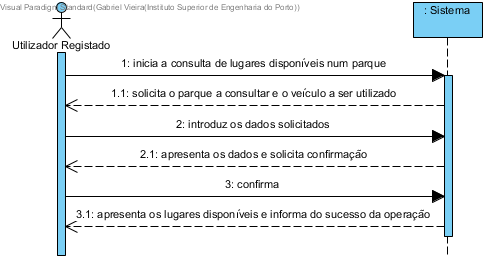

# UC4 - Consultar lugares de estacionamento disponíveis

## Formato Breve

O utilizador registado inicia a consulta de lugares de estacionamento livres. O sistema solicita o parque a consultar e o veículo a ser utilizado. O administrativo introduz os dados solicitados. O sistema valida e apresenta os dados ao utilizador registado, pedindo confirmação. O utilizador registado confirma. O sistema apresenta os lugares disponíveis e informa o utilizador registado do sucesso da operação.

## SSD

## Formato Completo

### Ator principal

Utilizador Registado

### Partes interessadas e seus interesses
* **Utilizador Registado:** pretende saber se existem lugares livres para estacionar o seu veículo num determinado parque.
* **Empresa:** pretende que os parques sejam utilizados sem problemas de lotação para cada tipo de veículo.

### Pré-condições
O parque tem de estar registado no sistema.

### Pós-condições
\-

## Cenário de sucesso principal (ou fluxo básico)

1. O utilizador registado inicia a consulta de lugares de estacionamento livres.
2. O sistema solicita o parque a consultar e o veículo a ser utilizado.
3. O administrativo introduz os dados solicitados.
4. O sistema valida e apresenta os dados ao utilizador registado, pedindo confirmação.
5. O utilizador registado confirma.
6. O sistema apresenta os lugares disponíveis e informa o utilizador registado do sucesso da operação.

### Extensões (ou fluxos alternativos)

a. O utilizador registado solicita o cancelamento da consulta de lugares de estacionamento dispníveis.

> O caso de uso termina.

4a. Dados mínimos obrigatórios em falta.
>	1. O sistema informa quais os dados em falta.
>	2. O sistema permite a introdução dos dados em falta (passo 3)
>
	>	2a. O administrativo não altera os dados. O caso de uso termina.

4b. O sistema detecta que os dados introduzidos (ou algum subconjunto dos dados) são inválidos.
> 1. O sistema alerta o administrativo para o facto. 
> 2. O sistema permite a sua alteração (passo 3).
> 
	> 2a. O administrativo não altera os dados. O caso de uso termina. 

### Requisitos especiais
\-

### Lista de Variações de Tecnologias e Dados
\-

### Frequência de Ocorrência
\-

### Questões em aberto
\-