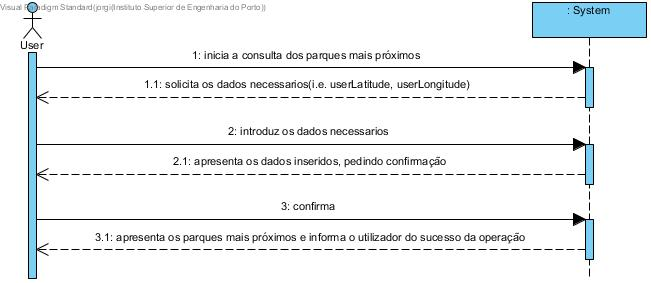

# UC5 - Apresentar parques mais próximos

## Formato Breve

O utilizador inicia a consulta dos parques mais próximos de um dado local. O sistema solicita os dados necessarios(i.e. userLatitude, userLongitude). O utilizador introduz os dados necessarios. O sistema apresenta os dados inseridos, pedindo confirmação. O utilizador confirma. O sistema apresenta os parques mais próximos e informa o utilizador do sucesso da operação.

## SSD

## Formato Completo

### Ator principal

Utilizador

### Partes interessadas e seus interesses
* **Utilizador:** pretende consultar os parques mais próximos de um dado local.
* **Empresa:** pretende fornecer informação aos utilizadores.

### Pré-condições
\-

### Pós-condições
\-

## Cenário de sucesso principal (ou fluxo básico)

1. O utilizador inicia a consulta dos parques mais próximos de um dado local.
2. O sistema solicita os dados necessarios(i.e. userLatitude, userLongitude).
3. O utilizador introduz os dados necessarios.
4. O sistema apresenta os dados inseridos, pedindo confirmação.
5. O utilizador confirma. 
6. O sistema apresenta os parques mais próximos e informa o utilizador do sucesso da operação.

### Extensões (ou fluxos alternativos)

a. O utilizador solicita o cancelamento da consulta dos parques mais próximos.

> O caso de uso termina.

4a. Dados mínimos obrigatórios em falta.
>	1. O sistema informa quais os dados em falta.
>	2. O sistema permite a introdução dos dados em falta (passo 3)
>
	>	2a. O utilizador não altera os dados. O caso de uso termina.

4b. O sistema detecta que os dados introduzidos (ou algum subconjunto dos dados) são inválidos.
> 1. O sistema alerta o utilizador para o facto. 
> 2. O sistema permite a sua alteração (passo 3).
> 
	> 2a. O utilizador não altera os dados. O caso de uso termina. 

### Requisitos especiais
\-

### Lista de Variações de Tecnologias e Dados
\-

### Frequência de Ocorrência
\-

### Questões em aberto
\-