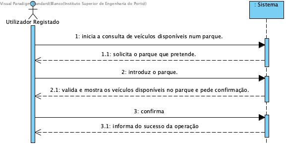

# Mostrar veículos disponíveis de um parque

## Formato Breve

O utilizador registado inicia a consulta de veículos disponíveis num parque. O sistema solicita o parque que pretende. O utilizador registado introduz o parque. O sistema valida e mostra os veículos disponíveis no parque e pede confirmação. O utilizador registado confirma. O sistema informa o utilizador registado do sucesso da operação.

## SSD

## Formato Completo

### Ator Principal

Utilizador Registado

### Partes interessadas seus interesses

* **Utilizador Registado:** pretende saber a disponibilidade de veículos de um parque.
* **Empresa:** pretende que os seus clientes tenham veículos disponíveis para serem usados.

### Pré-Condições
O parque tem de estar registado no sistema.

### Pós-Condições
n/a

### Cenário de sucesso principal (ou fluxo básico)

1. O utilizador registado inicia a consulta de veículos disponíveis num parque.
2. O sistema solicita o parque que pretende. 
3. O utilizador registado introduz o parque. 
4. O sistema valida e mostra os veículos disponíveis no parque e pede confirmação.
5. O utilizador registado confirma. 
6. O sistema informa o utilizador registado do sucesso da operação. 

### Extensões

*a. O utilizador registado solicita o cancelamento da adição do veículo.

> O caso de uso termina.

*4a. Dados mínimos obrigatorios em falta.
>		1. O sistema informa quais os dados em falta.
>		2. O sistema permite a introdução dos dados em falta.
>
        >		2a. O utilizador registado não altera os dados. O caso de uso termina.

*4b. O sistema deteta que os dados introduzidos são inválidos.
>		1. O sistema alerta o utilizador registado para o facto.
>		2. O sistema permite a sua alteração.
>
		>		2a. O utilizador registado não altera os dados. O caso de uso termina.

### Requisitos Especiais
\-

### Lista de Variações
\-

### Frequência de Ocorrência
\-

### Questões em Aberto
\-