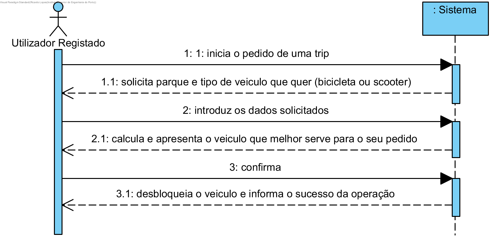

# UC7 - Fazer um pedido

## Formato Breve

O utilizador registado inicia o pedido de uma trip. O sistema solicita o parque e o tipo de veiculo que quer. O utilizador registado introduz os dados solicitados. O sistema valida e apresenta o veiculo que melhor se incaixa ao pedidoe pede confirmação. O utilizador registado confirma. O sistema desbloqueia o veiculo e informa do sucesso da operação.

## SSD

## Formato Completo

### Ator principal

Utilizador Registado

### Partes interessadas e seus interesses
* **Utilizador Registado:** pretende fazer um pedido
* **Empresa:** pretende que os pedidos sejam efectuados com sucesso.

### Pré-condições
O utilizador já tem de estar registado.

### Pós-condições
O pedido é efectuado.

## Cenário de sucesso principal (ou fluxo básico)

1. O utilizador registado inicia o pedido de uma trip.
2. O sistema solicita o parque e o tipo de veiculo que o cliente quer.
3. O utilizador registado introduz os dados solicitados.
4. O sistema valida e apresenta o parque a remover ao utilizador registado, pedindo confirmação.
5. O utilizador registado confirma.
6. O sistema desbloqueia o veiculo e informa do sucesso da operação.

### Extensões (ou fluxos alternativos)

a. O utilizador solicita o cancelamento do pedido.

> O caso de uso termina.

4a. Dados mínimos obrigatórios em falta.
>	1. O sistema informa quais os dados em falta.
>	2. O sistema permite a introdução dos dados em falta (passo 3)
>
	>	2a. O utilizador não altera os dados. O caso de uso termina.

4b. O sistema detecta que os dados introduzidos (ou algum subconjunto dos dados) são inválidos.
> 1. O sistema alerta o administrativo para o facto. 
> 2. O sistema permite a sua alteração (passo 3).
> 
	> 2a. O utilizador não altera os dados. O caso de uso termina. 

### Requisitos especiais
\-

### Lista de Variações de Tecnologias e Dados
\-

### Frequência de Ocorrência
\-

### Questões em aberto
\-