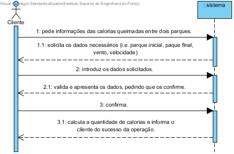

# UC9 - Consultar quantidade calorias queimadas

## Formato Breve

O cliente pede informações das calorias queimadas entre dois parques. O sistema solicita os dados necessários (i.e. parque inicial, paque final, vento, velocidade). O cliente introduz os dados solicitados. O sistema valida e apresenta os dados, pedindo que os confirme. O cliente confirma. O sistema calcula a quantidade de calorias e informa o cliente do sucesso da operação.

## SSD

## Formato Completo

### Ator principal

Cliente

### Partes interessadas e seus interesses
* **Cliente:** pretende saber as calorias queimadas.
* **Empresa:** pretende deixar o cliente satisfeito com a disponibilização do sistema de calcular calorias.

### Pré-condições
n/a

### Pós-condições
n/a

## Cenário de sucesso principal (ou fluxo básico)

1. O cliente pede informações das calorias queimadas entre dois parques.
2. O sistema solicita os dados necessários (i.e. parque inicial, paque final, vento, velocidade)
3. O cliente introduz os dados solicitados.
4. O sistema valida e apresenta os dados, pedindo que os confirme.
5. O cliente confirma.
6. O sistema calcula a quantidade de calorias e informa o cliente do sucesso da operação.

### Extensões (ou fluxos alternativos)

*a. O cliente solicita o cancelamento das informações.

> O caso de uso termina.

	
4a. Dados mínimos obrigatórios em falta.
>	1. O sistema informa quais os dados em falta.
>	2. O sistema permite a introdução dos dados em falta (passo 3).
>
	>	2a. O cliente não altera os dados. O caso de uso termina.

4b. O sistema detecta que os dados introduzidos (ou algum subconjunto dos dados) são inválidos.
> 1. O sistema alerta o cliente para o facto. 
> 2. O sistema permite a sua alteração (passo 3).
> 
	> 2a. O cliente não altera os dados. O caso de uso termina. 

### Requisitos especiais
\-

### Lista de Variações de Tecnologias e Dados
\-

### Frequência de Ocorrência
\-

### Questões em aberto